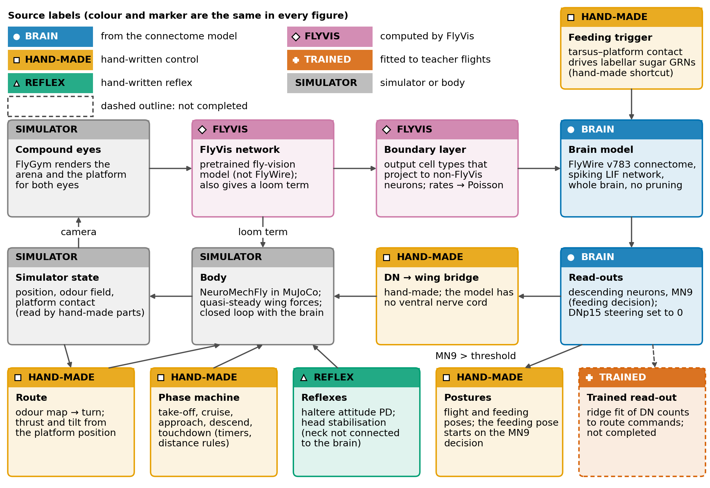
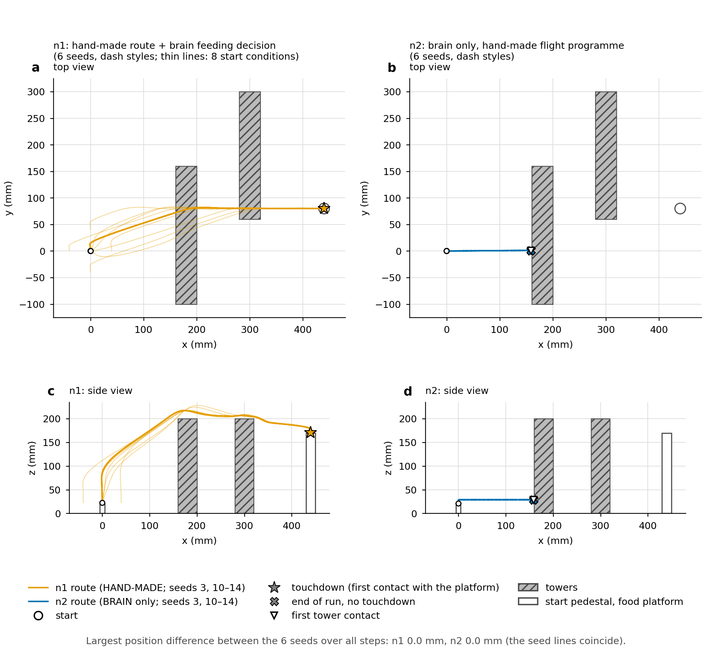
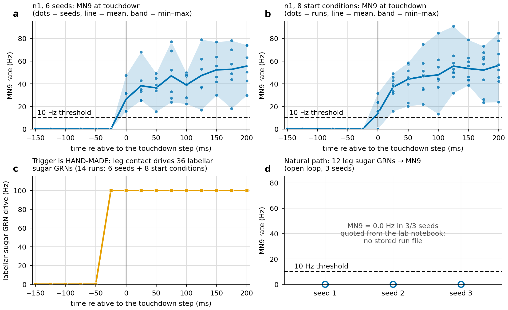
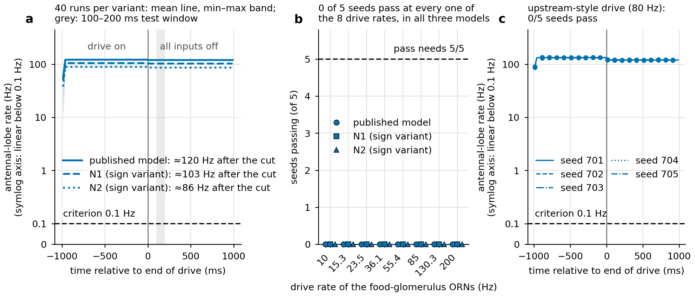
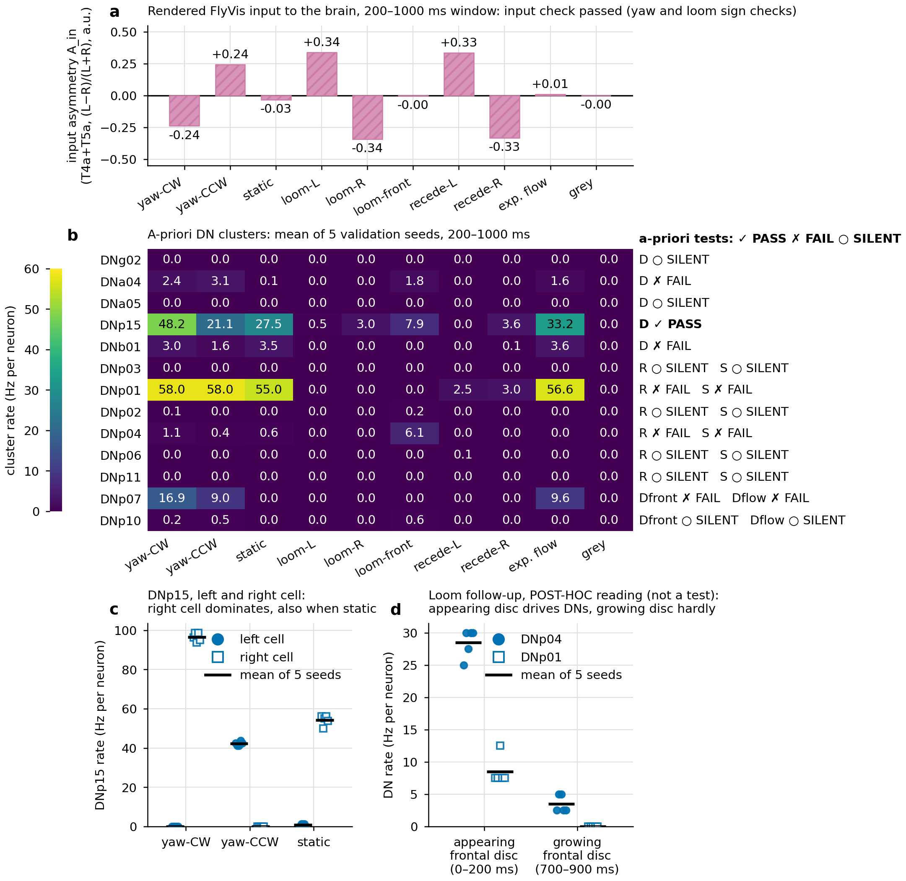
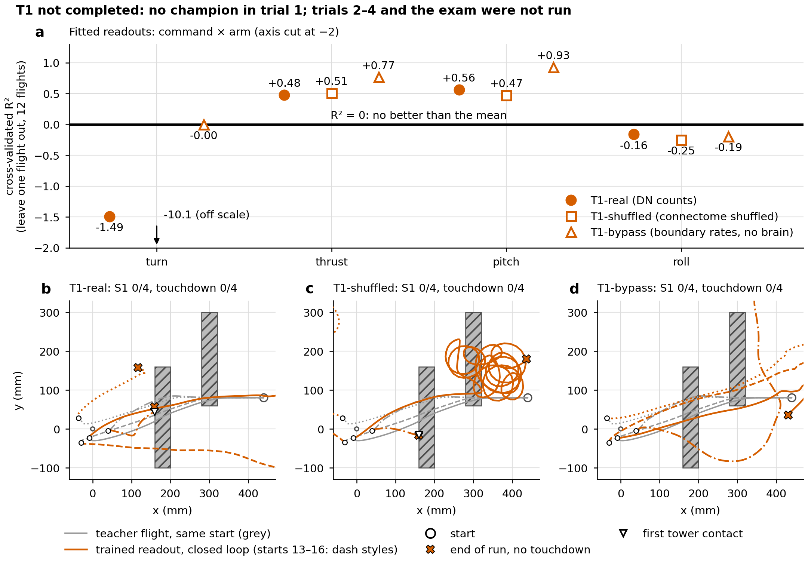
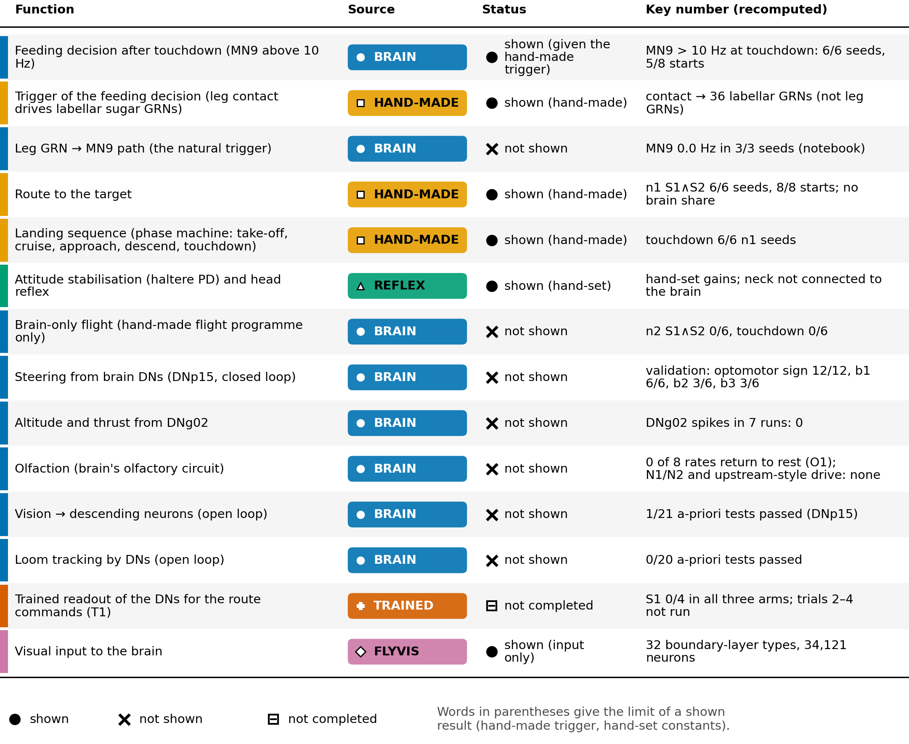
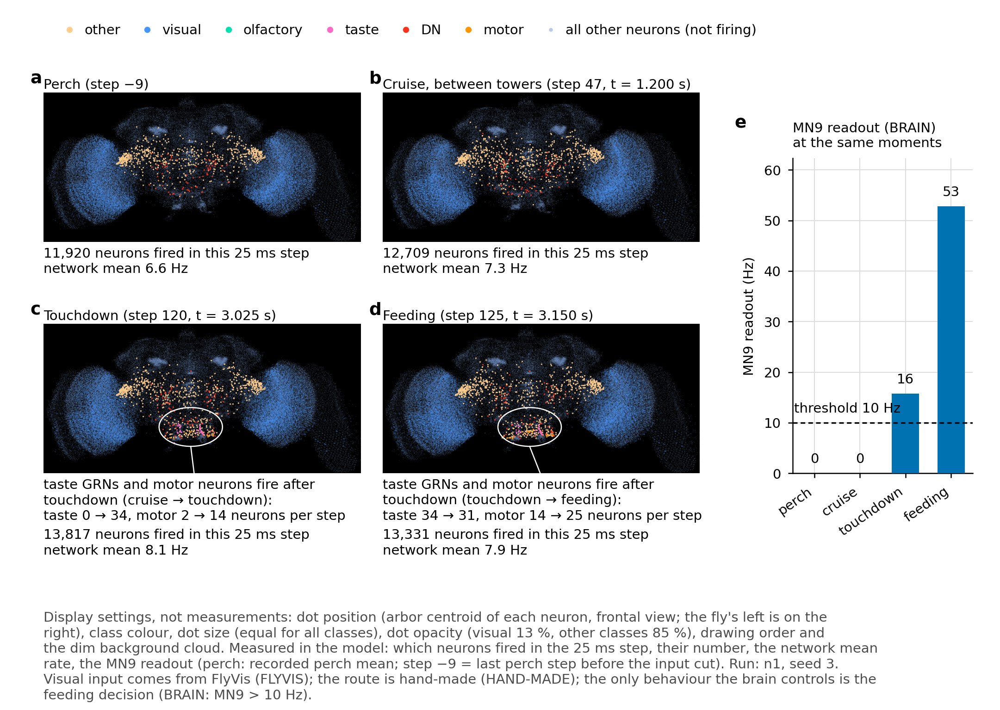

# Synaptera — report

From synapse to wing: what a whole-brain connectome model controls in closed-loop *Drosophila* flight.

This is the single English report of the project. It is a condensed account compiled from the Turkish lab
notebook (`docs/tr/REPORT_FINAL.md`, `docs/tr/REPORT_FINAL_V2.md`, `docs/tr/REPORT_SENSORY_A/A2/B.md`) and the pre-registration documents
(`docs/tr/SPEC_*.md`), not a translation of them. Every result number in this report is recomputed from the HDF5 run files
or printed by a report script (`scripts/diag/*_report.py --lang en`) and checked against this text by
`scripts/verify_report_final.py`; the exceptions are stated where they occur. Threshold values that define a
criterion are quoted from the SPEC files.

Labels used throughout (same as the README): **BRAIN** = read out from the connectome model; **HAND-MADE** =
hand-written control; **REFLEX** = hand-written reflex; **FLYVIS** = term computed by the FlyVis network (not
FlyWire). "Post-hoc" marks every analysis or run that was added after a pre-registered result was known.

## 1. Summary

- A whole-brain leaky integrate-and-fire model of the FlyWire v783 connectome (138,639 neurons, 15,091,983
  connections (pre–post neuron pairs; weight = synapse count), 54,492,922 synapses in total) is coupled in
  closed loop to the NeuroMechFly / FlyGym body. Task: take off from a pedestal, pass two towers, land on a
  food platform, feed.
- **The only behavioural decision that comes from the connectome model is the feeding decision** (MN9 readout
  above threshold while on the platform). Navigation, altitude, approach, landing, the head reflex and the
  postures are HAND-MADE.
- **The steering readout chosen for the brain (DNp15) failed its pre-registered validation**: (a) open-loop
  optomotor sign correct in 12/12; (b) closed-loop yaw stabilisation b1 6/6, b2 3/6, b3 3/6; (c) static scenes
  |turn| < 0.3 in 0/9. As the rule required, the DNp15 term was held at its perch baseline in the final runs.
- **The pre-registered final run final_v2a failed** (S1 ✗, S2 ✓): it landed and fed, but penetrated the top edge
  of tower 2 within one step (step 51, 130.9 µm). The brain-only arm final_v2c did not land.
- **Post-hoc control:** with the DNp15 term set to exactly 0 plus the hand-made head reflex and postures, the
  hybrid run n1 passed (S1 ✓, S2 ✓) and the brain-only run n2 failed. This does not replace final_v2a.
- **Visual DN screen (open loop, pre-registered, §3.8):** of 21 a-priori tests (yaw, loom, landing clusters) 1 passed (DNp15, yaw; with a right-dominant static baseline), 8 failed and 12 were silent; the exploratory screen gave 1 pass (DNbe001, expanding flow versus a static grating) among 10 candidates of 575 pairs. No loom, landing or DNg02 hypothesis was confirmed. Open loop only; the flights are unchanged.
- **Repeats (pre-registered, of the post-hoc n1 configuration):** n1 passed in 5/5 further seeds and in 8/8 pre-registered start positions / headings. Because the
  steering term is 0, the route does not depend on the seed (bit-identical across seeds); these repeats test the
  hand-made route and the MN9 decision, not route control by the brain.

### 1.1 What the brain controls in this model: summary
One row per function. Source: BRAIN / HAND-MADE / REFLEX / FLYVIS / TRAINED (labels above). Status: shown / not shown / not testable / not completed. Section numbers refer to this report. Table from `scripts/diag/summary_report.py` (numbers recomputed from the run files and the report scripts, checked line by line by `scripts/verify_report_final.py`).

| function | source | evidence | status |
|---|---|---|---|
| Feeding decision after touchdown (MN9 above 10 Hz) | **BRAIN** | §3.4, §3.5: MN9 above 10 Hz at the touchdown step in 6/6 n1 seeds (lowest 15.7 Hz) and in 5/8 start conditions (the others one step later); the trigger below is hand-made | shown (given the hand-made trigger) |
| Trigger of the feeding decision (leg contact drives labellar sugar GRNs) | **HAND-MADE** | §2.4: tarsus–platform contact is mapped by hand onto 36 labellar sugar GRNs at 100 Hz; there is no proboscis contact in the model | shown (hand-made shortcut) |
| Leg GRN → MN9 path (the natural trigger) | **BRAIN** | §4: driving the 12 leg sugar GRNs selected by connectivity left MN9 at 0.0 Hz in 3/3 seeds (lab-notebook number, no stored run) | not shown |
| Route to the target | **HAND-MADE** | §3.4, §3.5, §3.9: turn from the odour field of the simulator, thrust and tilt from the platform position; n1 S1 ∧ S2 6/6 seeds (bit-identical route) and 8/8 start conditions; teacher S1 13/16 and S2 16/16 in the 16 joint start draws | shown (hand-made; no brain contribution) |
| Landing sequence (phase machine: take-off, cruise, approach, descend, touchdown) | **HAND-MADE** | §2.3: timers and distance rules read the simulator position and contact; touchdown in 6/6 n1 seeds | shown (hand-made) |
| Attitude stabilisation (haltere PD) and head reflex | **REFLEX** | §2.3: hand-set constants (head yaw gain 0.6, roll/pitch gain 0.5, angle limit ±15°); the brain is not connected to the neck | shown (hand-set) |
| Brain-only flight (hand-made flight programme only) | **BRAIN** | §3.3, §3.4: n2 S1 ∧ S2 0/6 seeds, touchdown 0/6; final_c and final_v2c: no touchdown | not shown |
| Steering from brain DNs (DNp15, closed loop) | **BRAIN** | §3.2: pre-registered validation failed (optomotor sign 12/12, yaw stabilisation b1 6/6, b2 3/6, b3 3/6, static-scene turn command below 0.3 in 0/9); final_v2a S1 ✗ | not shown |
| Altitude and thrust from DNg02 | **BRAIN** | §4: DNg02 fired 0 spikes in all seven reported runs | not shown |
| Olfaction (brain's olfactory circuit) | **BRAIN** | §3.7: stage O1 0 of 8 returned to rest; the N1/N2 sign variants 0 of 8 drive rates; upstream-style drive 0 of 5 seeds (the circuit locks into a persistent state) | not shown |
| Vision → descending neurons (open loop) | **BRAIN** | §3.8: 1 of 21 a-priori tests passed (DNp15, lateralised even for a static grating); exploratory 1 of 10 candidates (DNbe001, general motion) | not shown |
| Loom tracking by DNs (open loop) | **BRAIN** | §3.8b: 0 of 20 a-priori tests passed; the frontal-disc 'appearance' response is a post-hoc observation | not shown |
| Trained readout of the DNs for the route commands (T1) | **TRAINED** | §3.9b: trial 1 fitted from 12 teacher flights; T1 not completed: no champion in trial 1 (S1 0/4 in all three arms); trials 2–4 and the exam were not run. | not completed |
| Visual input to the brain | **FLYVIS** | §2.4: FlyVis (pretrained, not FlyWire) → 32 boundary-layer types (34,121 neurons) → Poisson drive into FlyWire | shown (input only) |

**Reading.** In this model, with these inputs, the only behaviour controlled by the connectome model is the feeding decision, and it is triggered by a hand-made contact-to-taste mapping. Usable sensory information about the position of the target could not be shown in the model: the olfactory circuit locks into a persistent state, the steering and altitude readouts failed or stayed silent, and the open-loop visual screens gave one lateralised pass. Known reasons that limit these tests: there is no ventral nerve cord (the DN → wing path is a hand-made bridge), the model has no resting activity, and several transmitter signs are predictions. The route, the landing sequence and the reflexes are hand-made, and the trained readout was not completed, so the model gives no evidence about whether a connectome-based route readout is possible.

A `noOlf` / `--no-olfaction` label means that the BRAIN's olfactory input is off. The hand-made route still reads the odour field of the simulator directly.

## 2. Methods

### 2.1 Brain model
- FlyWire v783 connectome as used by Shiu et al. (2024): `brain_model/Completeness_783.csv` (neurons, index order)
  and `Connectivity_783.parquet` (recurrent connections), loaded with the set-up of `brain_model/model.py`. The
  whole brain is simulated in every reported run (no pruning; `--dev-subnet` runs are development only and
  marked DEV).
- Uniform LIF neurons with the parameters of Shiu et al.: v0 = vrst = −52 mV, vth = −45 mV, τm = 20 ms,
  τsyn = 5 ms, refractory period 2.2 ms, synaptic delay 1.8 ms, w_syn = 0.275 mV per synapse (signed by the
  predicted transmitter). Brian2, dt = 0.1 ms; the brain and the body exchange data every 25 ms decision step.
- Sensory inputs are Poisson spike trains onto identified FlyWire neurons; outputs are spike counts of
  identified descending neurons (DNs) and motor neurons, low-pass filtered (τ = 50 ms) by the VNC bridge.
  There is no ventral nerve cord model: the DN → wing path is a hand-made bridge.
- Before take-off, the first 10 decision steps (perch) calibrate the DN baselines; then all brain inputs are cut
  for 8 steps (200 ms) to test for self-sustained activity; then the closed loop starts.

### 2.2 Body and arena
- NeuroMechFly v2 body in FlyGym / MuJoCo. Flight forces and torques are quasi-steady and stroke-averaged; wing
  flapping is drawn for display only. Arena: take-off pedestal, two box towers, a food platform with a food drop.
- MuJoCo contacts: arena obstacle geoms use solimp 0.9 0.999 0.001 0.5 2 / solref 0.02 1; fly–arena contact
  pairs keep the FlyGym defaults.

### 2.3 What controls what (final configuration n1)

Flags: `--hybrid --vision-boundary --no-olfaction --no-brain-steer --head-reflex --postures`. Every motor term
carries one label and is stored separately in the HDF5 file.

| component | label | how |
|---|---|---|
| feeding decision (proboscis) | **BRAIN** (decision); input via a **HAND-MADE** shortcut | MN9 readout (2 CB0701 neurons) > 10 Hz while on the platform. The contact input is hand-made (tarsus–platform contact → 100 Hz Poisson drive to the 36 labellar sugar GRNs, see §2.4): the legs touch the platform but proboscis taste neurons are driven. Only the GRN → MN9 path is the connectome. The leg sugar GRNs selected by connectivity do not drive MN9 (§4) |
| steering term (DNp15 L − R) | BRAIN, set to 0 | recorded but not used in the command (`--no-brain-steer`, post-hoc). In the pre-registered final runs it was held at its perch baseline (`--ablate-dn DNp15`) |
| navigation | **HAND-MADE** | odour-gradient map (`turn_hand`), a hand-made sensor that reads the odour field directly; the brain's olfactory input is off |
| altitude, collective thrust, forward speed, body pitch | **HAND-MADE** | climb floor, approach altitude target, fixed cruise pitch, world-frame position controller |
| take-off, approach, landing, leg extension | **HAND-MADE** | phase timers and distance rules |
| head stabilisation | **HAND-MADE** reflex | neck joints counter the body angular velocity; yaw gain 0.6, roll/pitch gain 0.5, angle limit ±15°, yaw reset saccade at 9°. All constants (yaw, roll and pitch gain, angle limit, reset saccade, latency) are hand-set; Hengstenberg (1988) on head-roll compensation in blowflies is related literature, not the source of the constants (the paper could not be opened; only its bibliographic record was checked). The brain is not connected to the neck motor neurons |
| postures (flight, standing, feeding) | **HAND-MADE** | the feeding posture is triggered by the MN9 decision; the posture itself is hand-made |
| haltere reflex | **REFLEX** | PD on body angular velocity at every physics substep; recorded as `turn_reflex` |
| looming avoidance term | **FLYVIS** | T5 left/right activity of the FlyVis network |
| visual input | FLYVIS → BRAIN input | FlyGym compound eyes → FlyVis network → 32 boundary-layer types (34,121 neurons) → Poisson drive into FlyWire |

**"noOlf" / `--no-olfaction`** (run names, flags, video file names) means that the **brain's** olfactory input is off. The hand-made route is not affected: it reads the odour field of the simulator directly (`turn_hand`), so it does not depend on the brain's olfactory circuit.

In the brain-only arm (n2, final_v2c, final_c) there is no hand-made navigation and no altitude target; a
hand-made flight programme keeps the fly airborne.

### 2.4 Inputs used in the final runs
- **Vision ("sB" input set):** the FlyVis network is driven by the FlyGym eyes; its 32 output-boundary cell types
  that project mainly to non-FlyVis neurons drive the matching FlyWire neurons (SPEC_SENSORY_INPUTS §3.3,
  `data/vision_boundary_783.csv`). Final-v1 used the T4/T5 neurons only.
- **Olfaction of the brain: off** (`--no-olfaction`; the hand-made route still reads the simulator's odour field); see the negative findings (§4).
- **Taste:** 36 labellar sugar gustatory receptor neurons (FlyWire annotations: sensory / gustatory /
  `sugar/water`, cell type LB3, maxillary–labial nerve): the 20 left neurons of Shiu et al. (2024) plus 16 right
  homologs chosen by connectivity profile (`data/sugar_grn_783.csv`). They are driven at 100 Hz while any tarsus
  touches the food platform. **This contact → GRN mapping is a HAND-MADE shortcut:** proboscis (labellar) taste
  neurons stand in for leg contact; the model has no proboscis contact. The leg sugar GRNs selected by
  connectivity (SA_VTV_2) do not drive MN9 (§4) and are not used in the reported runs (`--leg-grn` off).

### 2.5 Criteria
- **S1:** no tower contact before touchdown — both the end-of-step contact flag and the intra-step penetration
  must be 0. A run without touchdown fails S1 (✗): the pre-registered definition requires the phase to reach
  touchdown (≥ 2 tarsi on the platform for 2 consecutive steps) with no tower contact up to it
  (SPEC_BRAIN_CONTROL "Honest hybrid final", success criterion S1; adopted unchanged by SPEC_SENSORY_INPUTS
  §3.3c and restated in §3.3f). **S2:** feeding (`is_feeding` = 1) in at least one step after touchdown. **Success = S1 ∧ S2.**
- **DNp15 validation** (SPEC_SENSORY_INPUTS §3.3c, same criteria as SPEC_BRAIN_CONTROL "Step 2 decisions"; seeds
  6/7/8): (a) open-loop optomotor sign correct in 4 conditions × 3 seeds; (b) closed-loop hover with a sudden ±30°
  yaw perturbation, b1 (residual yaw rate below half the perturbation rate), b2 (turn command opposite to the
  perturbation), b3 (heading error smaller than with the steering term ablated), each 6/6; (c) |turn| < 0.3 in
  3 static scenes × 3 seeds. Rule: if the validation fails, the DNp15 term is held at its perch baseline in all
  final runs and no other readout, gain or normalisation is tried.
- Record criteria (pass/fail reported, no decision attached): B-K1 (network rate of undriven neurons, drift,
  neuropil maximum), B-K3 (time per step, memory), B-K4 (MN9 silent without contact), B-H1..B-H3 (head reflex).

### 2.6 Pre-registration
"Pre-registered" means that the criteria and decision rules were committed to this repository before the runs
they judge; they were not registered externally, and commit timestamps are not independent evidence of timing.
The commit-by-commit record is `docs/PREREGISTRATION_LOG.md`. Exceptions recorded there:
- Stage B (SPEC §3.3b): a short smoke run was launched seconds before the criteria commit (the full run started
  after it).
- Final-v2 (SPEC §3.3c): two scripts that only compute the FlyVis input rates of the stimulus sequences (no brain,
  no DN readout) were launched before the criteria commit; the criterion runs started after it.
- Start-position test (SPEC §3.3f): criteria commit and first run start have the same timestamp; the order comes
  from the command sequence (commit first).
- Two SPEC rules (SPEC_BRAIN_CONTROL R2 readout sets and "Step 0 decisions II") say they were fixed before the
  measurement but were committed together with the results, so the repository gives no ordering evidence for them.
- The `--no-brain-steer` control (n1/n2) is post-hoc: it was added after the result of final_v2a was known. Its
  own criteria (SPEC §3.3d) were committed before the n1/n2 runs.

## 3. Results

All runs: whole brain, seed 3 unless stated, 300 decision steps (7.5 s), `--no-olfaction`, no video during the
simulation.

### 3.1 Pre-registered final runs

final-v1 (T4/T5 visual input; SPEC_BRAIN_CONTROL "Honest hybrid final"): final_a hybrid with the DNp15 term
active, final_b hybrid with DNp15 ablated, final_c brain only. final-v2 (sB visual input; SPEC_SENSORY_INPUTS
§3.3c): final_v2a hybrid and final_v2c brain only, both with DNp15 held at its perch baseline because the
validation failed (final_v2b was skipped by the rule, since final_v2a was already ablated). final-v1 ran before
the leg-extension ramps were added, so v1 and v2 differ in more than the visual input.

| measure | final_a | final_b | final_c | final_v2a | final_v2c |
|---|---|---|---|---|---|
| touchdown | 2.87 s (step 114) | 3.07 s (step 122) | none | 3.47 s (step 138) | none |
| touchdown speed | 6.3 mm/s | 5.8 mm/s | — | 5.8 mm/s | — |
| tower contact, end of step (steps) | 0 | 0 | 3 | 0 | 0 |
| intra-step tower contact before touchdown (steps) | 1 (first: step 52) | 0 | 18 (first: step 38) | 1 (first: step 51) | 0 |
| max. penetration | 6.3 µm | 0.0 µm | 43.4 µm | 130.9 µm | 0.0 µm |
| **S1** | ✗ | ✓ | ✗ | **✗** | ✗¹ |
| **S2** | ✓ | ✓ | ✗ | **✓** | ✗ |
| MN9 first > 10 Hz | 2.90 s | 3.07 s | — | 3.47 s | — |
| feeding steps | 185 | 178 | 0 | 162 | 0 |
| mean MN9 while feeding | 57.0 Hz | 55.7 Hz | — | 52.2 Hz | — |
| closest to food / final | 2.0 / 2.0 mm | 1.9 / 1.9 mm | 318.7 / 330.2 mm | 3.4 / 3.4 mm | 413.6 / 772.4 mm |
| wings-on steps | 114 | 122 | 300 | 138 | 300 |
| turn shares HAND-MADE / REFLEX / FLYVIS / BRAIN | 0.28 / 0.26 / 0.03 / 0.43 | 0.31 / 0.20 / 0.06 / 0.43 | 0 / 0.40 / 0 / 0.60 | 0.32 / 0.24 / 0.03 / 0.42 | 0 / 0.37 / 0 / 0.63 |
| ratio Σ\|BRAIN\| / Σ\|total\| | 0.97 | 1.22 | 1.00 | 1.08 | 1.00 |
| BRAIN steering term | variable (DNp15 active) | constant +0.102 | variable (DNp15 active) | constant +0.244 | constant +0.244 |
| total heading change (wings on) | −8.0° | −38.7° | −357.3° | −119.9° | −532.1° |
| active neurons (total) | 9.48 % | 8.05 % | 10.65 % | 29.68 % | 30.44 % |
| undriven neurons: active / mean rate | 1.86 % / 0.139 Hz | 1.38 % / 0.130 Hz | 2.33 % / 0.183 Hz | 11.12 % / 2.188 Hz | 10.58 % / 2.216 Hz |
| network mean rate | 1.04 Hz | 0.98 Hz | 1.63 Hz | 7.35 Hz | 7.61 Hz |

¹ final_v2c had no tower contact (end of step and intra-step both 0) but no touchdown either; a run without
touchdown fails S1 by the pre-registered definition (§2.5).

Turn shares are Σ|term| over wings-on steps divided by the sum over the four terms. The ratio Σ|BRAIN| / Σ|total|
was the pre-registered brain measure; it is not a share and can exceed 1 because the terms partly cancel.
**The BRAIN share is not live brain activity in every run:** with DNp15 ablated the BRAIN term is a constant
offset in final_b, final_v2a and final_v2c (the same value in every step, +0.102 or +0.244; row "BRAIN steering
term"), so its share only measures the size of that offset. The BRAIN term varies with brain activity only in
final_a and final_c.

- **final_a failed S1** by an intra-step touch of the top edge of tower 2 (6.3 µm, step 52); **final_b passed**.
  One seed each: the pre-registration excludes reading final_b as "the brain is harmful".
- **final_v2a failed S1** at the same tower edge (130.9 µm, step 51). It landed at 3.47 s and fed for 162 steps.
- **The ablation constant is not a "brainless" baseline.** It is the perch DNp15 rate minus the reference rate.
  With the sB reference (DNp15 L / R 22.1 / 63.6 Hz; T4/T5 reference 15.2 / 63.2 Hz) the constant became +0.244
  (right turn) instead of +0.102. final_v2a differs from the Stage B run final_sB only in this constant, and final_sB
  had passed (§3.3).
- **Brain-only arm:** final_c (DNp15 active) touched towers and did not land; final_v2c, with a constant steering
  term, flew in circles (−532.1°) and did not land.
- The visual boundary layer raised the active fraction of the network from 8–11 % (final-v1) to about 30 %.

### 3.2 DNp15 validation (pre-registered, seeds 6/7/8)
- **(a) passed:** open-loop optomotor sign correct in 12/12.
- **(b) failed:** b1 6/6, b2 3/6, b3 3/6. The brain turned right after both perturbations: it corrected a
  perturbation to the left and amplified a perturbation to the right.
- **(c) failed:** static scenes |turn| < 0.3 in 0/9. On arena scenes DNp15 is right-dominant (left near 0 Hz) and
  the normalised readout reads this as a right turn.
- The DNp15 readout itself had been chosen post-hoc (SPEC_BRAIN_CONTROL); it also failed the earlier validation
  with seeds 3/4/5 (lab notebook).

### 3.3 Additional control, post-hoc (SPEC_SENSORY_INPUTS §3.3d)
n1 (hybrid) and n2 (brain only): DNp15 term exactly 0 (`--no-brain-steer`), head reflex and postures on. The
criteria were committed before the runs, but the control itself was added after final_v2a's result; it does not
replace final_v2a. final_sB (Stage B, `--hybrid --vision-boundary`, constant +0.102) is shown for comparison.

| measure | n1 | final_v2a | final_sB | n2 | final_v2c |
|---|---|---|---|---|---|
| BRAIN steering term | 0 | constant +0.244 | constant +0.102 | 0 | constant +0.244 |
| touchdown | 3.02 s (step 120) | 3.47 s (step 138) | 3.07 s (step 122) | none | none |
| tower contact, end of step (steps) | 0 | 0 | 0 | 264 | 0 |
| intra-step tower contact before touchdown (steps) | 0 | 1 (first: step 51) | 0 | 264 (first: step 36) | 0 |
| max. penetration | 0.0 µm | 130.9 µm | 0.0 µm | 35.3 µm | 0.0 µm |
| **S1** | **✓** | ✗ | ✓ | ✗ | ✗¹ |
| **S2** | **✓** | ✓ | ✓ | ✗ | ✗ |
| feeding steps | 180 | 162 | 178 | 0 | 0 |
| mean MN9 while feeding | 52.3 Hz | 52.2 Hz | 54.4 Hz | — | — |
| closest to food | 0.5 mm | 3.4 mm | 1.9 mm | 324.4 mm | 413.6 mm |
| total heading change (wings on) | +1.7° | −119.9° | −38.1° | +1.3° | −532.1° |
| turn shares HAND-MADE / REFLEX / FLYVIS / BRAIN | 0.54 / 0.35 / 0.11 / 0.00 | 0.32 / 0.24 / 0.03 / 0.42 | 0.31 / 0.20 / 0.06 / 0.43 | 0 / 1.00 / 0 / 0 | 0 / 0.37 / 0 / 0.63 |
| active neurons (total) | 29.02 % | 29.68 % | 29.23 % | 28.12 % | 30.44 % |
| network mean rate | 7.42 Hz | 7.35 Hz | 7.51 Hz | 4.10 Hz | 7.61 Hz |

¹ final_v2c: no tower contact, but no touchdown; S1 ✗ by the pre-registered definition (§2.5).

Turn shares: the BRAIN term is a constant offset in final_v2a, final_sB and final_v2c (DNp15 ablated; same value in
every step), not live brain activity, and exactly 0 in n1 and n2 (`--no-brain-steer`).

- **n1 passed (S1 ∧ S2).** Its route was almost straight (+1.7°). MN9 crossed the threshold in the touchdown
  step and the fly fed for 180 steps, 0.5 mm from the food.
- **Reading:** final_v2a's failure is consistent with the constant +0.244 right turn shifting the route onto the
  tower edge. But n1 differs from final_v2a in three things at once (steering term, head reflex, postures) and in
  one seed; attributing the difference to the steering term alone is a hypothesis.
- **n2 failed.** With no steering command and no altitude target it flew straight into the face of tower 1 at
  step 36 and stayed against it for the rest of the run (264 contact steps). final_v2c had avoided this only
  because its constant right turn made it circle.
- In n1 the only decision from the brain is again feeding (MN9). The head reflex is HAND-MADE; neck motor neurons
  in the model stay below a few Hz (lab notebook, REPORT_FINAL_V2 §6.3).

### 3.4 Multi-seed repeat (pre-registered, SPEC_SENSORY_INPUTS §3.3e)
Repeat of the post-hoc n1/n2 control (§3.3); its criteria were committed before these runs. n1 and n2
configurations unchanged; only the seed (10–14). Table from `scripts/diag/seeds_report.py --lang en`;
the seed 3 rows are the §3.3 runs.

| run | seed | S1 | S2 | touchdown step | MN9 at the touchdown step (Hz) | first feeding step | feeding steps | MN9 during feeding, mean / lowest (Hz) | tower contact (end of step) | intra-step tower contact (before td) | BADQACC |
|---|---|---|---|---|---|---|---|---|---|---|---|
| n1 | 3 (§3.3d) | ✓ | ✓ | 120 | 15.7 | 120 | 180 | 52.3 / 15.7 | 0 | 0 | 0 |
| n1 | 10 | ✓ | ✓ | 120 | 47.2 | 120 | 180 | 51.6 / 18.1 | 0 | 0 | 0 |
| n1 | 11 | ✓ | ✓ | 120 | 15.7 | 120 | 180 | 52.8 / 15.7 | 0 | 0 | 0 |
| n1 | 12 | ✓ | ✓ | 120 | 31.5 | 120 | 180 | 52.2 / 21.6 | 0 | 0 | 0 |
| n1 | 13 | ✓ | ✓ | 120 | 31.5 | 120 | 180 | 51.9 / 19.2 | 0 | 0 | 0 |
| n1 | 14 | ✓ | ✓ | 120 | 15.7 | 120 | 180 | 51.8 / 15.3 | 0 | 0 | 0 |
| n2 | 3 (§3.3d) | ✗ | ✗ | none | — | — | 0 | — / — | 264 | 264 | 0 |
| n2 | 10 | ✗ | ✗ | none | — | — | 0 | — / — | 264 | 264 | 0 |
| n2 | 11 | ✗ | ✗ | none | — | — | 0 | — / — | 264 | 264 | 0 |
| n2 | 12 | ✗ | ✗ | none | — | — | 0 | — / — | 264 | 264 | 0 |
| n2 | 13 | ✗ | ✗ | none | — | — | 0 | — / — | 264 | 264 | 0 |
| n2 | 14 | ✗ | ✗ | none | — | — | 0 | — / — | 264 | 264 | 0 |

- **n1** (seeds 10–14): S1 ∧ S2 5/5; MN9 > 10 Hz at the touchdown step: 5/5, lowest 15.7 Hz, highest 47.2 Hz.
- **n2** (seeds 10–14): S1 ∧ S2 0/5; no touchdown (the MN9 contact measure does not apply).

Determinism (seeds 10–14 vs seed 3, same arm, all steps; largest |difference|):
- **n1**: pos 0, heading 0, turn_total 0, phase 0, is_feeding 0, tower_contact 0, leg_pose 0
- **n2**: pos 0, heading 0, turn_total 0, phase 0, is_feeding 0, tower_contact 0, leg_pose 0

- **Interpretation:** with the steering term at 0, the only path from the brain to the body is the MN9 decision,
  which acts only after touchdown. Route, touchdown and tower values are therefore bit-identical across seeds:
  "S1 5/5" is five repeats of one hand-made route, not five independent confirmations.
- The seed-dependent result is the feeding decision. MN9 was above threshold at the touchdown step in all five
  seeds; five seeds are a small sample for the error rate of this decision.

### 3.5 Start position / heading test (pre-registered, SPEC_SENSORY_INPUTS §3.3f)
Post-hoc n1 configuration (§3.3), criteria committed before these runs; seed 3; the take-off pedestal is shifted by ±40 mm or the initial heading rotated by ±30° / ±60°.
Because the steering term is 0, this tests the robustness of the hand-made route and landing chain and of the MN9
decision. Table from `scripts/diag/starts_report.py --lang en`.

| condition | flag | S1 | S2 | touchdown (step / s) | MN9 at the touchdown step (Hz) | first feeding step | feeding steps | closest to food | total heading change | closest to a tower (before td) | tower contact (end of step) | intra-step tower contact (before td) | max. penetration | BADQACC |
|---|---|---|---|---|---|---|---|---|---|---|---|---|---|---|
| n1 | — (§3.3d n1) | ✓ | ✓ | 120 / 3.02 s | 15.7 | 120 | 180 | 0.5 mm | +1.7° | 4.4 mm | 0 | 0 | 0.0 µm | 0 |
| st_xp40 | `--start-offset 40 0` | ✓ | ✓ | 115 / 2.90 s | 0.0 | 116 | 184 | 0.5 mm | +1.6° | 4.7 mm | 0 | 0 | 0.0 µm | 0 |
| st_xm40 | `--start-offset -40 0` | ✓ | ✓ | 125 / 3.15 s | 23.6 | 125 | 175 | 0.5 mm | +1.9° | 4.1 mm | 0 | 0 | 0.0 µm | 0 |
| st_yp40 | `--start-offset 0 40` | ✓ | ✓ | 119 / 3.00 s | 0.0 | 120 | 180 | 0.4 mm | +1.7° | 4.0 mm | 0 | 0 | 0.0 µm | 0 |
| st_ym40 | `--start-offset 0 -40` | ✓ | ✓ | 121 / 3.05 s | 15.7 | 121 | 179 | 0.5 mm | +1.6° | 4.6 mm | 0 | 0 | 0.0 µm | 0 |
| st_yawp30 | `--start-yaw 30` | ✓ | ✓ | 120 / 3.02 s | 31.5 | 120 | 180 | 0.5 mm | -25.8° | 5.4 mm | 0 | 0 | 0.0 µm | 0 |
| st_yawm30 | `--start-yaw -30` | ✓ | ✓ | 118 / 2.97 s | 15.7 | 118 | 182 | 0.5 mm | +30.8° | 5.5 mm | 0 | 0 | 0.0 µm | 0 |
| st_yawp60 | `--start-yaw 60` | ✓ | ✓ | 116 / 2.92 s | 23.6 | 116 | 184 | 0.5 mm | -57.0° | 3.3 mm | 0 | 0 | 0.0 µm | 0 |
| st_yawm60 | `--start-yaw -60` | ✓ | ✓ | 114 / 2.87 s | 0.0 | 115 | 185 | 0.3 mm | +62.2° | 2.8 mm | 0 | 0 | 0.0 µm | 0 |

- **S1 ∧ S2: passed in 8/8 conditions**.
- S1 8/8, S2 8/8; touchdown 8/8; MN9 > 10 Hz at the touchdown step: 5/8 (lowest 0.0 Hz).
- touchdown → first feeding: 0–1 steps; closest to a tower (before td): 2.8–5.5 mm (n1 4.4 mm).
- route convergence (record): the heading comes within 5° of n1 at t = 1.02–1.42 s and stays there up to step 60; at t = 1.32 s the distance |Δy| from the n1 route is 0.2–5.2 mm.

- **Interpretation:** from different starts the hand-made odour map pulls the route onto the same line, and all
  eight runs cross tower 2 at the same place, a few mm from its surface — the edge that final_v2a penetrated.
  The result shows that the hand-made route is robust over this range of starts with a margin of a few mm; it is
  not evidence of route control by the brain. In three runs MN9 was below threshold at the touchdown step and
  crossed it one step later.

### 3.6 Videos (render only)
Rendered from the HDF5 files of n1 and n2 with `render_flight_video_v2.py` (`run_videos_vis.sh`); no simulation was
re-run. In the videos the hand-made route takes the fly to the food; the brain decides to feed (the on-screen "brain odour input OFF" refers to the brain only). All on-screen text is in English and uses the labels above; the FlyVis display layer is marked "display
only, not driven". H.264, yuv420p, one key frame per second; numbers measured with ffprobe.

Brain panels (a display setting, not a measurement). Simulated spikes in class colours, change mode (a neuron glows
while its 250 ms rate is above its baseline of the first 0.5 s), decay τ = 80 ms. Every neuron is one soft dot of
the same size for all classes (Gaussian, σ 0.7 px; drawn at 2× resolution and downscaled; position = synapse
centroid). Dots add up; a hue-preserving tone map (1 − e^−x)^γ, γ 0.6, on the brightest channel, very bright cores
shift slightly towards white, and a light bloom (blur σ 5 px, weight 0.22) is added. Silent neurons form a dim
grey-blue base cloud, dimmer with distance from the camera. Brightness uses a fixed display gain per class, set once
per run: for the crowded classes the 99.5th percentile of the class-only exposure over 40 frames maps to a fixed
level (visual 80 %, other 70 %); for the small classes (taste, DN, motor, olfactory) the gain is
3 / (median intensity of their active neurons), so that a typical firing neuron reaches near-full brightness and
the crowded visual class does not mask the small circuits. On screen: "display gain per class (fixed); dot size
equal for all neurons". The earlier renders (`run_videos_en.sh`, `*_en.mp4`, kept) used one common gain and a
soft glow without dots.

| video | file | duration | frames | fps | key-frame interval | resolution | pixels |
|---|---|---|---|---|---|---|---|
| n1 | `simulations/flight_v44_hybrid_sB_noBrSteer_head_pose_noOlf_n1_v2_change_en_vis.mp4` | 33.60 s | 1008 | 30 | 30 frames (1 s) | 1920×1080 | yuv420p |
| n2 | `simulations/flight_v45_sB_noBrSteer_head_pose_ablOdor_noOlf_n2_v2_change_en_vis.mp4` | 44.00 s | 1320 | 30 | 30 frames (1 s) | 1920×1080 | yuv420p |
| n1 \| n2 | `simulations/flight_n1_vs_n2_v2_compare_en_vis.mp4` | 33.60 s | 1008 | 30 | 30 frames (1 s) | 1920×1080 | yuv420p |

### 3.7 Olfaction, stage O1 (pre-registered, SPEC_SENSORY_INPUTS §3.4a)
**Question:** can the model extract direction from odour? The established finding (§4) is that with realistic resting
ORN input the antennal lobe locks into a self-sustaining state. O1 removes the resting input: only the 298 ORNs of the
six food glomeruli (DM1, DM2, DM4, VA2, VM2, DP1m; both antennae) are driven for 1 s at one of 8 rates (10–200 Hz,
logarithmic), then all inputs are cut. Whole brain, open loop, no body, no flight run; LIF parameters, connectome and
NT signs unchanged. Criteria and stopping rule were committed before any simulation (`5b82f84`;
`docs/PREREGISTRATION_LOG.md` #10). **Criterion:** 100–200 ms after the cut, the mean rate of the antennal lobe (AL, driven
ORNs excluded) and of the not-driven network is < 0.1 Hz in 5/5 seeds (seeds 101–105, 40 runs). **Stopping rule:** if no
rate passes, odour stays off and the left/right test (O2) is not run. Tables from `scripts/diag/o1_report.py`.

**Step 0, anatomy (FlyWire v783 files, no simulation; `scripts/diag/so_anatomy.py`):**
- Food-glomerulus ORNs: 153 left / 145 right = 298 (DM1 35/33, DM2 29/25, DM4 20/20, VA2 34/33, VM2 19/18, DP1m 16/16).
- ORN → PN synapses, food ORNs → all ALPN: ipsilateral 21,534 / contralateral 15,856 = 1.36 (ipsilateral +35.8 %), 149 target PNs.
- ORN → PN synapses, food ORNs → uniglomerular ALPN: ipsilateral 16,114 / contralateral 13,280 = 1.21 (ipsilateral +21.3 %), 45 target PNs.
- ORN → PN synapses, all 53 glomeruli → all ALPN: ipsilateral 99,492 / contralateral 65,829 = 1.51 (ipsilateral +51.1 %), 588 target PNs.
- Ipsilateral / contralateral ratio by glomerulus (ORN → all ALPN): DM1 1.31, DM2 0.96, DM4 1.25, VA2 0.99, VM2 1.27, DP1m 1.73.

Naming: for DNa01, DNa04 and DNa05 the FlyWire cell type of that name is a different cell from the hemibrain neuron of
that name (the hemibrain DNa01 is the FlyWire type DNae001); the mapping comes from the annotation columns only and is
UNVERIFIED against the literature.

| descending-neuron type | model DN list: cells (L / R) | note |
|---|---|---|
| DNa02 | 1 / 1 | |
| DNae001 (hemibrain name DNa01, the literature steering DN; mapping UNVERIFIED) | 1 / 1 | |
| DNa01 (FlyWire name; hemibrain type VES006) | 1 / 1 | |
| DNa15 | 1 / 1 | |
| DNb01 | 1 / 1 | |
| DNp03 | 1 / 1 | |
| DNae002 (hemibrain name DNa04) | 1 / 1 | |
| DNa04 (FlyWire name) | 1 / 1 | |
| DNae004 (hemibrain name DNa05) | 1 / 1 | |
| DNa05 (FlyWire name) | 1 / 1 | |
| DNg02 (sub-types DNg02_a … DNg02_h) | 13 / 12 | no cell is named plain DNg02 |
| DNae014 | 0 / 0 | not in the annotations (UNVERIFIED) |

- Shortest ORN → DNa02 path (food ORNs, edges ≥ 5 synapses): 3 hops, 1599 shortest paths; most frequent intermediate types `M_l2PNl20` 62 %, `CB0683` 22 %, `lLN2F_b` 15 %.
- Fraction of the shortest paths through Kenyon cells: 0 %; through MBON32: 0 %.

**O1 result (open loop, 8 rates × 5 seeds):**

| drive rate (Hz) | seeds passing | AL after the cut, 100–200 ms (Hz, min–max) | not-driven after the cut, 100–200 ms (Hz, min–max) | AL, 400–500 ms (Hz, mean) | not-driven, 400–500 ms (Hz, mean) | ALPN during the drive (Hz, mean) | uniglomerular PN during the drive (Hz, mean) |
|---|---|---|---|---|---|---|---|
| 10.0 | 0/5 | 119.0–119.7 | 3.38–3.42 | 119.6 | 3.41 | 84.7 | 127.2 |
| 15.3 | 0/5 | 119.0–120.0 | 3.40–3.43 | 119.5 | 3.41 | 84.9 | 127.5 |
| 23.5 | 0/5 | 119.2–120.2 | 3.40–3.44 | 119.4 | 3.41 | 85.1 | 127.8 |
| 36.1 | 0/5 | 118.9–119.7 | 3.39–3.42 | 119.7 | 3.42 | 85.3 | 128.1 |
| 55.4 | 0/5 | 118.7–120.2 | 3.40–3.45 | 119.5 | 3.41 | 85.9 | 128.7 |
| 85.0 | 0/5 | 119.0–119.9 | 3.39–3.42 | 119.5 | 3.42 | 86.4 | 129.2 |
| 130.3 | 0/5 | 119.2–119.9 | 3.39–3.41 | 119.3 | 3.40 | 87.1 | 129.9 |
| 200.0 | 0/5 | 119.3–119.9 | 3.39–3.44 | 119.8 | 3.42 | 88.0 | 130.6 |

- **O1 result: 0 of 8 drive rates pass in 5/5 seeds** (40 runs, seeds 101, 102, 103, 104, 105); the lowest rate (10 Hz) already fails in 5/5 seeds.
- ALPN response over the drive rates: 0 inversions in the seed mean (84.7 → 88.0 Hz over a 20-fold range of drive).

- **Measured:** the network did not return to rest at any drive rate. The state after the cut (AL about 119 Hz, whole
  not-driven network about 3.4 Hz) is the same at 10 Hz and at 200 Hz, and it is still there 400–500 ms after the cut.
  The ALPN response during the drive grows by only a few Hz over the 20-fold range of drive.
- **Not tested:** drive rates below 10 Hz, a drive shorter than 1 s, and any change of model parameters (none allowed
  by the pre-registration).
- **Consequence (mechanical, by the stopping rule):** odour stays off and O2 (left/right asymmetry of descending
  neurons) was not run. The first-synapse ipsilateral excess found by the anatomy (+35.8 %) could therefore not be
  followed to the descending neurons. This is an open-loop result about the model; it says nothing about flight behaviour,
  and the odour-dependent route in the reported flight runs remains the hand-made map (§2.3).

#### Exploratory diagnostic (post hoc): who sustains the persistent state?
**Label: exploratory diagnostic, post hoc. Not pre-registered, not a criterion, no decision depends on it.** One extra
run, "diagnostic run, not part of O1": the O1 run at 10 Hz, seed 101, repeated with the spike count of every neuron in
every 25 ms step stored (`scripts/diag/so_o1_diag.py`). Nothing was changed or tuned; no remedy was tried. Tables from
`scripts/diag/o1_diag_report.py`. Windows: drive = 250–1000 ms; W1 = 100–200 ms and W2 = 400–500 ms after the cut;
"active" = share of the cells with at least one spike in the window; classes are the FlyWire annotation classes
(`cell_class`, `cell_sub_class`), the ORNs are the 2,275 typed ORNs.

- Reproduction check: the population traces (AL, KC, LH, ALPN, not-driven; 80 steps) of this run differ from the O1 run `o1_r10.0_s101` by at most 0.0e+00 Hz.

| cell class | cells | rate during the drive, 250–1000 ms (Hz) | rate W1, 100–200 ms after the cut (Hz) | active in W1 | rate W2, 400–500 ms after the cut (Hz) | active in W2 |
|---|---|---|---|---|---|---|
| ORN, driven (food glomeruli) | 298 | 10.68 | 0.60 | 3.4 % | 0.74 | 3.4 % |
| ORN, not driven | 1,977 | 6.44 | 6.33 | 16.2 % | 6.50 | 16.5 % |
| PN, uniglomerular (ALPN) | 277 | 127.28 | 127.33 | 96.4 % | 127.87 | 96.4 % |
| PN, multiglomerular (ALPN) | 400 | 56.80 | 57.02 | 69.0 % | 56.35 | 69.0 % |
| PN, other ALPN | 8 | 8.67 | 8.75 | 37.5 % | 8.75 | 37.5 % |
| LN (ALLN) | 429 | 131.72 | 131.14 | 83.2 % | 131.68 | 83.4 % |
| ALIN | 24 | 45.50 | 45.42 | 54.2 % | 46.25 | 54.2 % |
| ALON | 14 | 74.29 | 75.00 | 92.9 % | 72.86 | 92.9 % |
| Kenyon cells | 5,177 | 32.38 | 31.86 | 63.8 % | 31.63 | 63.8 % |
| APL | 2 | 344.67 | 345.00 | 100.0 % | 340.00 | 100.0 % |
| MBON | 96 | 84.90 | 84.90 | 65.6 % | 83.85 | 67.7 % |
| LHLN | 514 | 69.91 | 69.67 | 87.4 % | 69.36 | 86.8 % |
| LHCENT | 42 | 67.02 | 65.95 | 54.8 % | 66.43 | 54.8 % |
| all other neurons | 129,381 | 1.07 | 1.06 | 2.1 % | 1.06 | 2.2 % |
| (overlapping) neurons with dominant neuropil LH | 2,383 | 46.07 | 45.95 | 64.8 % | 45.65 | 64.9 % |

- Whole network in W1: 47,898 spikes from 7,845 of 138,639 neurons.

**LN types (ALLN, 95 types), those with a spiking cell in W1 (89 types), by W1 rate:**

| LN type | cells | rate during the drive (Hz) | rate W1 (Hz) | active in W1 | rate W2 (Hz) |
|---|---|---|---|---|---|
| v2LN30 | 2 | 299.33 | 300.00 | 100.0 % | 300.00 |
| il3LN6 | 2 | 292.67 | 295.00 | 100.0 % | 290.00 |
| lLN1_bc | 30 | 291.33 | 293.67 | 100.0 % | 291.67 |
| lLN2X03 | 6 | 290.44 | 290.00 | 100.0 % | 295.00 |
| lLN2F_a | 4 | 285.67 | 287.50 | 100.0 % | 280.00 |
| lLN2F_b | 4 | 288.33 | 287.50 | 100.0 % | 282.50 |
| lLN2T_c | 4 | 288.00 | 287.50 | 100.0 % | 282.50 |
| lLN1_a | 3 | 287.56 | 286.67 | 100.0 % | 283.33 |
| lLN2X04 | 4 | 286.33 | 285.00 | 100.0 % | 287.50 |
| lLN2X05 | 4 | 281.33 | 285.00 | 100.0 % | 287.50 |
| lLN2T_e | 4 | 285.00 | 277.50 | 100.0 % | 285.00 |
| lLN2X11 | 4 | 268.33 | 267.50 | 100.0 % | 272.50 |
| lLN2P_c | 9 | 266.07 | 258.89 | 100.0 % | 263.33 |
| lLN2T_b | 4 | 265.67 | 257.50 | 100.0 % | 270.00 |
| lLN2X12 | 13 | 256.00 | 256.15 | 100.0 % | 255.38 |
| lLN2P_b | 12 | 256.44 | 254.17 | 100.0 % | 255.83 |
| lLN2P_a | 13 | 251.90 | 249.23 | 100.0 % | 252.31 |
| lLN2T_d | 4 | 232.33 | 230.00 | 100.0 % | 230.00 |
| lLN2X10 | 4 | 220.67 | 220.00 | 100.0 % | 220.00 |
| lLN2X07 | 3 | 213.33 | 216.67 | 100.0 % | 210.00 |
| ALBN1 | 2 | 196.67 | 195.00 | 100.0 % | 200.00 |
| lLN2X06 | 3 | 192.44 | 190.00 | 100.0 % | 193.33 |
| lLN2X09 | 2 | 175.33 | 180.00 | 100.0 % | 180.00 |
| CB3417 | 7 | 171.43 | 171.43 | 100.0 % | 172.86 |
| lLN10 | 2 | 160.67 | 165.00 | 100.0 % | 165.00 |
| vLN28,vLN29 | 4 | 157.00 | 157.50 | 100.0 % | 150.00 |
| v2LN36 | 2 | 161.33 | 155.00 | 100.0 % | 165.00 |
| v2LN42c | 2 | 146.00 | 155.00 | 100.0 % | 145.00 |
| CB1676 | 4 | 151.00 | 152.50 | 100.0 % | 152.50 |
| v2LN5 | 4 | 152.67 | 152.50 | 100.0 % | 147.50 |
| LN60a | 2 | 144.67 | 145.00 | 100.0 % | 140.00 |
| LN60b | 2 | 144.00 | 145.00 | 100.0 % | 145.00 |
| lLN2X02 | 6 | 147.56 | 145.00 | 100.0 % | 145.00 |
| OA-VUMa5 | 2 | 145.33 | 140.00 | 100.0 % | 140.00 |
| v2LN32 | 2 | 134.67 | 140.00 | 100.0 % | 135.00 |
| CB3326 | 4 | 141.33 | 137.50 | 100.0 % | 142.50 |
| CB1266 | 2 | 134.67 | 135.00 | 100.0 % | 130.00 |
| l2LN21 | 2 | 142.00 | 135.00 | 100.0 % | 145.00 |
| v2LN41a | 2 | 138.00 | 135.00 | 100.0 % | 140.00 |
| v2LN42b | 2 | 128.67 | 125.00 | 100.0 % | 130.00 |
| vLN25 | 4 | 129.00 | 125.00 | 100.0 % | 132.50 |
| v2LN49 | 4 | 118.00 | 120.00 | 100.0 % | 120.00 |
| v2LNX01 | 2 | 115.33 | 120.00 | 100.0 % | 120.00 |
| v2LN3A1_b | 8 | 120.00 | 118.75 | 100.0 % | 118.75 |
| v2LN42a | 2 | 112.00 | 115.00 | 100.0 % | 110.00 |
| v2LN46b | 6 | 113.56 | 111.67 | 100.0 % | 113.33 |
| CB3172 | 2 | 107.33 | 110.00 | 100.0 % | 105.00 |
| v2LN3A1_a | 2 | 107.33 | 105.00 | 100.0 % | 110.00 |
| v2LN40_2 | 4 | 103.67 | 105.00 | 100.0 % | 105.00 |
| CB3679 | 2 | 96.00 | 100.00 | 100.0 % | 100.00 |
| v2LN33 | 4 | 96.67 | 100.00 | 100.0 % | 92.50 |
| vLN24 | 2 | 108.00 | 100.00 | 100.0 % | 110.00 |
| CB3633 | 3 | 93.78 | 96.67 | 100.0 % | 93.33 |
| v2LN41b | 2 | 93.33 | 95.00 | 100.0 % | 90.00 |
| CB2345 | 3 | 96.00 | 93.33 | 100.0 % | 93.33 |
| l2LN20 | 4 | 92.00 | 90.00 | 100.0 % | 90.00 |
| v2LN46a | 3 | 89.33 | 86.67 | 100.0 % | 86.67 |
| CB2571 | 5 | 86.67 | 84.00 | 100.0 % | 86.00 |
| (untyped ALLN) | 1 | 80.00 | 80.00 | 100.0 % | 80.00 |
| CB1673 | 4 | 81.67 | 80.00 | 100.0 % | 82.50 |
| v2LN47 | 5 | 76.27 | 76.00 | 100.0 % | 82.00 |
| CB3575 | 2 | 74.67 | 75.00 | 100.0 % | 70.00 |
| l2LN19 | 4 | 71.33 | 75.00 | 100.0 % | 75.00 |
| v2LN39a | 4 | 65.67 | 65.00 | 100.0 % | 67.50 |
| CB1546 | 7 | 61.33 | 61.43 | 100.0 % | 62.86 |
| v2LN31 | 2 | 80.67 | 55.00 | 100.0 % | 60.00 |
| v2LN38 | 4 | 51.67 | 52.50 | 100.0 % | 50.00 |
| lLN13 | 5 | 52.27 | 50.00 | 100.0 % | 54.00 |
| v2LN34E | 6 | 51.11 | 48.33 | 83.3 % | 50.00 |
| CB2845 | 4 | 41.67 | 42.50 | 100.0 % | 42.50 |
| CB1141,CB1285 | 12 | 42.56 | 42.50 | 100.0 % | 45.83 |
| CB1132 | 4 | 34.00 | 32.50 | 100.0 % | 37.50 |
| CB3202 | 4 | 26.67 | 27.50 | 100.0 % | 27.50 |
| CB3007 | 7 | 25.71 | 27.14 | 71.4 % | 27.14 |
| CB1824 | 10 | 24.67 | 25.00 | 60.0 % | 25.00 |
| CB1545 | 6 | 24.44 | 23.33 | 66.7 % | 25.00 |
| CB2661 | 3 | 24.00 | 23.33 | 66.7 % | 23.33 |
| l2LN22 | 4 | 19.67 | 20.00 | 75.0 % | 20.00 |
| l2LN23 | 4 | 16.00 | 17.50 | 50.0 % | 15.00 |
| lLN9 | 2 | 13.33 | 15.00 | 50.0 % | 10.00 |
| CB1048 | 4 | 15.00 | 12.50 | 50.0 % | 17.50 |
| CB2471 | 5 | 10.13 | 10.00 | 40.0 % | 10.00 |
| CB2527 | 6 | 10.67 | 10.00 | 33.3 % | 10.00 |
| lLN8 | 4 | 7.67 | 7.50 | 25.0 % | 7.50 |
| CB1668 | 7 | 6.48 | 7.14 | 14.3 % | 5.71 |
| CB1686 | 8 | 5.83 | 6.25 | 25.0 % | 6.25 |
| vLN26 | 2 | 8.67 | 5.00 | 50.0 % | 5.00 |
| CB1013 | 7 | 3.43 | 2.86 | 28.6 % | 2.86 |
| CB2908 | 4 | 3.00 | 2.50 | 25.0 % | 2.50 |

**The 20 cell types with the highest mean rate in W1** (all types, any size; ties by name):

| cell type | cell class | cells | rate W1 (Hz) | active in W1 | rate W2 (Hz) |
|---|---|---|---|---|---|
| APL | MBIN | 2 | 345.00 | 100.0 % | 340.00 |
| v2LN30 | ALLN | 2 | 300.00 | 100.0 % | 300.00 |
| DPM | MBIN | 2 | 295.00 | 100.0 % | 290.00 |
| il3LN6 | ALLN | 2 | 295.00 | 100.0 % | 290.00 |
| lLN1_bc | ALLN | 30 | 293.67 | 100.0 % | 291.67 |
| lLN2X03 | ALLN | 6 | 290.00 | 100.0 % | 295.00 |
| lLN2F_a | ALLN | 4 | 287.50 | 100.0 % | 280.00 |
| lLN2F_b | ALLN | 4 | 287.50 | 100.0 % | 282.50 |
| lLN2T_c | ALLN | 4 | 287.50 | 100.0 % | 282.50 |
| lLN1_a | ALLN | 3 | 286.67 | 100.0 % | 283.33 |
| lLN2X04 | ALLN | 4 | 285.00 | 100.0 % | 287.50 |
| lLN2X05 | ALLN | 4 | 285.00 | 100.0 % | 287.50 |
| lLN2T_e | ALLN | 4 | 277.50 | 100.0 % | 285.00 |
| DP1l_adPN | ALPN | 2 | 275.00 | 100.0 % | 275.00 |
| DP1m_adPN | ALPN | 2 | 270.00 | 100.0 % | 270.00 |
| VP2_adPN | ALPN | 2 | 270.00 | 100.0 % | 275.00 |
| lLN2X11 | ALLN | 4 | 267.50 | 100.0 % | 272.50 |
| VL2p_adPN | ALPN | 2 | 265.00 | 100.0 % | 270.00 |
| lLN2P_c | ALLN | 9 | 258.89 | 100.0 % | 263.33 |
| lLN2T_b | ALLN | 4 | 257.50 | 100.0 % | 270.00 |

**Do the ORNs themselves fire after the cut?** In W1, 331 of 2,275 ORNs (14.5 %) spike at least once (driven food ORNs: 10 of 298; not-driven ORNs: 321 of 1977); in W2: 336.

Synaptic input of the ORNs (connectome, model signs). Columns: ORN set; incoming synapses (all stored connections, no threshold); excitatory share of the synapses; then, for the ORNs that spike in W1 only, the presynaptic spikes in W1 weighted by synapse count and sign (spikes × synapses).

| ORN set | cells | incoming synapses | of which from ORNs / PNs / LNs / other | excitatory share (all inputs) | excitatory share (from ORNs) | excitatory share (from PNs) | excitatory share (from LNs) |
|---|---|---|---|---|---|---|---|
| driven food ORNs | 298 | 43,466 | 10.8 % / 2.2 % / 86.6 % / 0.4 % | 50.2 % | 100.0 % | 98.4 % | 42.7 % |
| not-driven ORNs | 1,977 | 118,012 | 12.3 % / 2.1 % / 84.0 % / 1.6 % | 62.0 % | 99.4 % | 98.3 % | 56.5 % |
| all ORNs | 2,275 | 161,478 | 11.9 % / 2.2 % / 84.7 % / 1.3 % | 58.8 % | 99.5 % | 98.4 % | 52.7 % |
| ORNs spiking in W1 | 331 | 30,588 | 12.4 % / 2.4 % / 83.1 % / 2.1 % | 73.0 % | 99.8 % | 98.2 % | 69.9 % |

Input events that the spiking ORNs received in W1 (presynaptic spikes in W1 × synapse count; excitatory / inhibitory), by presynaptic class:

| presynaptic class | spikes in W1 | excitatory events | inhibitory events |
|---|---|---|---|
| ORN, driven (food glomeruli) | 18 | 10 (0.0 %) | 0 (0.0 %) |
| ORN, not driven | 1,252 | 12,992 (2.6 %) | 18 (0.0 %) |
| PN, uniglomerular (ALPN) | 3,527 | 11,906 (2.4 %) | 15 (0.0 %) |
| PN, multiglomerular (ALPN) | 2,281 | 1,095 (0.2 %) | 148 (0.1 %) |
| PN, other ALPN | 7 | 0 (0.0 %) | 0 (0.0 %) |
| LN (ALLN) | 5,626 | 475,825 (94.7 %) | 204,052 (99.8 %) |
| ALIN | 109 | 48 (0.0 %) | 161 (0.1 %) |
| ALON | 105 | 51 (0.0 %) | 31 (0.0 %) |
| any other neuron | 34,973 | 375 (0.1 %) | 0 (0.0 %) |

- Events onto the spiking ORNs in W1: 502,302 excitatory, 204,425 inhibitory (excitatory share 71.1 %).

The 10 presynaptic cell types that supply most of the excitatory events onto the spiking ORNs in W1. "Model sign" = share of the type's output synapses that are excitatory in `Connectivity_783`; literature transmitter, confidence and Codex `nt_type` of the cells are from `data/nt_literature_783.csv` (SPEC_SENSORY_INPUTS §3.2c; only the 370 types of that table are listed there, — = not in it; `NaN` = no Codex transmitter, which the model treats as excitatory). `top_nt` = most frequent transmitter prediction in the FlyWire annotations (number of cells / cells of the type); it is not the source of the model sign:

| presynaptic type | cell class | presynaptic cells | excitatory events | inhibitory events | share of all excitatory events | model sign (excitatory output synapses) | literature transmitter (confidence) | Codex nt_type | top_nt (annotation) |
|---|---|---|---|---|---|---|---|---|---|
| lLN2F_a | ALLN | 4 | 92,844 | 0 | 18.5 % | 100 % | — | — | gaba (4/4) |
| lLN2P_b | ALLN | 12 | 73,914 | 0 | 14.7 % | 100 % | gaba (high) | NaN8,GABA4 | gaba (12/12) |
| il3LN6 | ALLN | 2 | 63,693 | 0 | 12.7 % | 100 % | gaba (high) | NaN2 | acetylcholine (1/2) |
| lLN2T_e | ALLN | 4 | 55,346 | 0 | 11.0 % | 100 % | — | — | serotonin (4/4) |
| lLN2T_b | ALLN | 4 | 47,935 | 0 | 9.5 % | 100 % | acetylcholine (medium) | NaN4 | serotonin (4/4) |
| lLN2X12 | ALLN | 13 | 25,765 | 0 | 5.1 % | 100 % | — | — | acetylcholine (12/13) |
| lLN2X04 | ALLN | 4 | 21,973 | 0 | 4.4 % | 100 % | — | — | gaba (4/4) |
| lLN2X11 | ALLN | 4 | 19,037 | 0 | 3.8 % | 100 % | — | — | serotonin (4/4) |
| lLN1_bc | ALLN | 30 | 13,880 | 0 | 2.8 % | 100 % | acetylcholine (medium) | NaN29,SER1 | dopamine (12/30) |
| lLN2T_c | ALLN | 4 | 11,830 | 0 | 2.4 % | 100 % | acetylcholine (medium) | SER4 | serotonin (4/4) |

**Measured.**
- The run reproduces the O1 run exactly (first line). The activity after the cut is confined to a few classes. The antennal-lobe
  local neurons (LN, ALLN), the APL and DPM neurons, the uniglomerular PNs, the Kenyon cells, the MBONs and the LH neurons
  fire at the same rate after the cut as during the drive; "all other neurons" are near 1 Hz and mostly silent (class table).
  W2 equals W1 in every class.
- **The ORNs fire after the cut.** The not-driven ORNs, which receive no external input at all in this experiment, are
  active in W1 and keep firing in W2 at about the rate they have during the drive; the driven food ORNs, which
  carry the external drive, are almost silent after the cut (class table and the ORN line above).
- The input of the spiking ORNs is synaptic and comes mostly from the antennal-lobe LNs: about 83 % of their incoming
  synapses are from LNs, and in W1 almost all of the excitatory events they receive are from LNs (event table above).
  ORN→ORN and PN→ORN synapses are almost all excitatory in the model but contribute few events.
- Of the LN→ORN input, the ten LN types in the last table supply most of the excitatory events. In `Connectivity_783`
  all of their output synapses are excitatory.

**Interpretation (not tested).**
- In the model the ORNs are part of a recurrent loop: ORN → PN/LN → (excitatory) LN → ORN. The persistent state would then not
  need the odour drive to continue, which agrees with O1 (the state is the same at every drive rate). This is a reading of
  the measurements; nothing was removed or silenced to test it.
- The sign table suggests a candidate reason: among the ten LN types, the literature table lists GABA for two types
  (lLN2P_b, il3LN6), the annotation `top_nt` lists GABA also for lLN2F_a and lLN2X04, and for several types Codex has no
  transmitter (`NaN`), which the model reads as excitatory. In stage A2 (REPORT_SENSORY_A2.md), literature signs for 24
  neurons in 8 types lowered the persistent rate but did not remove it, so the sign of LN→ORN synapses is a candidate, not an
  established cause. Whether it is the cause would need a manipulation, which is outside this diagnostic.
- One run, one seed and one rate: the numbers say how the state is distributed in that run, not how variable it is.

#### Stage O1 under neurotransmitter-sign variants (pre-registered, SPEC_SENSORY_INPUTS §3.4b; part 2/4)
**Label: MODEL VARIANTS, not the published model.** The published model (all results above and in the rest of this report) is unchanged.
Criteria, the two variants, the decision rule and the null control were committed before any simulation of this part (`ef6c3ff`;
`docs/PREREGISTRATION_LOG.md` #11). **Question:** the exploratory diagnostic above found that the persistent state is sustained by
antennal-lobe local neurons (LNs) whose output is excitatory in the model although, for several types, Codex has no transmitter
prediction. Does a sign rule that fills the missing predictions remove the lock-up? **Variants (whole brain, no region-specific setting):**
N1 (`--nt-impute`): only neurons without a Codex `nt_type` change; each takes the sign of the synapse-weighted majority of the predicted
transmitters of the other cells of its `cell_type` (ACh, DA, 5-HT, OA → excitatory; GABA, Glu → inhibitory); N2 = N1 plus the existing
`--nt-literature` rule (applied after N1). **Protocol:** O1 exactly as in part 1/4 (8 rates, seeds 101–105, criterion AL and not-driven
network < 0.1 Hz 100–200 ms after the cut in 5/5 seeds), 40 runs per variant. **Decision rule:** O2 only with a variant that passes at ≥ 1 rate.
Tables from `scripts/diag/nt_report.py` (the audit tables are the brief form; `scripts/diag/nt_audit.py` prints all LN types).

**Step 0, audit (no simulation):**

**(a) Neurons without a Codex v783 nt_type prediction ("empty").**

- Empty neurons: **19,042** of 138,639 (13.7 %); neurons without an annotation `top_nt`: 301 (293 of them also empty in Codex nt_type).
- Sign the published model gives the empty neurons (`Excitatory` of `Connectivity_783`): **excitatory 12,686**, **inhibitory 5,722**, no output synapses 634.
- Output synapses of the empty neurons: 3,074,064 of 54,492,922 (5.6 %); treated as excitatory 1,149,962 (37.4 %), as inhibitory 1,924,102.
- Annotation `top_nt` of the empty neurons: acetylcholine 8,651, glutamate 5,318, gaba 3,202, serotonin 1,197, NaN 293, dopamine 232, octopamine 149.
- Empty neurons without an annotation `cell_type`: 922.

| super class | empty neurons | all neurons | share empty |
|---|---|---|---|
| optic | 8,261 | 77,521 | 10.7 % |
| sensory | 7,533 | 16,353 | 46.1 % |
| central | 1,605 | 32,380 | 5.0 % |
| visual_projection | 564 | 8,037 | 7.0 % |
| descending | 321 | 1,299 | 24.7 % |
| sensory_ascending | 307 | 581 | 52.8 % |
| ascending | 236 | 1,736 | 13.6 % |
| motor | 81 | 110 | 73.6 % |
| endocrine | 72 | 76 | 94.7 % |
| visual_centrifugal | 48 | 524 | 9.2 % |
| (none) | 14 | 22 | 63.6 % |

| dominant neuropil (top 12 by empty neurons) | empty neurons | all neurons | share empty |
|---|---|---|---|
| ME | 7,333 | 58,598 | 12.5 % |
| WED | 4,468 | 4,812 | 92.9 % |
| LA | 2,111 | 6,668 | 31.7 % |
| GNG | 995 | 5,222 | 19.1 % |
| LO | 681 | 16,751 | 4.1 % |
| LOP | 608 | 8,027 | 7.6 % |
| AL | 515 | 2,977 | 17.3 % |
| PVLP | 277 | 1,728 | 16.0 % |
| SAD | 247 | 982 | 25.2 % |
| FB | 229 | 1,837 | 12.5 % |
| AMMC | 201 | 509 | 39.5 % |
| IPS | 151 | 1,558 | 9.7 % |

**(b) Antennal-lobe local neurons (ALLN, all types).**

- 429 cells, 95 cell types (cells without a type grouped as "(no type)"); Codex-empty cells: 150.
- Output synapses of the ALLN: 758,902; **treated as excitatory by the model: 494,901 (65.2 %)**.
- By annotation `top_nt` of the cell (cells, excitatory output synapses, inhibitory output synapses): gaba: 147 cells, 100,396 / 186,870; serotonin: 40 cells, 191,854 / 0; acetylcholine: 80 cells, 134,621 / 4,384; glutamate: 148 cells, 19,701 / 72,747; dopamine: 12 cells, 46,905 / 0; octopamine: 2 cells, 1,424 / 0.

| LN type | cells | Codex-empty cells | model sign (excitatory output synapses) | `top_nt` (annotation, cells) | mean `top_nt_conf` | `known_nt` (annotation) | output synapses |
|---|---|---|---|---|---|---|---|
| lLN1_bc | 30 | 29 | 100 % | dopamine12;acetylcholine11;serotonin7 | 0.29 | acetylcholine | 112,184 |
| lLN2F_b | 4 | 0 | 0 % | gaba4 | 0.56 | — | 78,882 |
| lLN2X12 | 13 | 7 | 100 % | acetylcholine12;serotonin1 | 0.35 | — | 39,442 |
| lLN2F_a | 4 | 2 | 100 % | gaba4 | 0.35 | — | 34,782 |
| lLN2X03 | 6 | 1 | 100 % | serotonin6 | 0.35 | acetylcholine | 27,872 |
| lLN2P_b | 12 | 8 | 100 % | gaba12 | 0.34 | gaba, MIP; acetylcholine-negative | 27,576 |
| lLN2T_b | 4 | 4 | 100 % | serotonin4 | 0.34 | acetylcholine | 27,002 |
| lLN2P_c | 9 | 0 | 0 % | gaba9 | 0.55 | — | 25,397 |
| il3LN6 | 2 | 2 | 100 % | acetylcholine1;gaba1 | 0.33 | gaba | 24,121 |
| lLN2T_e | 4 | 2 | 100 % | serotonin4 | 0.33 | — | 23,185 |
| lLN2X04 | 4 | 2 | 100 % | gaba4 | 0.37 | — | 22,496 |
| v2LN30 | 2 | 2 | 100 % | serotonin1;glutamate1 | 0.28 | — | 22,106 |
| lLN2T_d | 4 | 0 | 0 % | gaba4 | 0.60 | — | 21,177 |
| lLN2T_c | 4 | 0 | 100 % | serotonin4 | 0.35 | acetylcholine | 20,200 |
| lLN2X11 | 4 | 0 | 100 % | serotonin4 | 0.41 | — | 19,821 |

(15 of 95 LN types shown, by output synapses; the full table is the output of `scripts/diag/nt_audit.py`.)

**(c) LN types whose cells do not agree: 48 of 95.**

| LN type | cells | Codex-empty cells | `top_nt` (annotation, cells) | model signs present | what differs | output synapses |
|---|---|---|---|---|---|---|
| lLN1_bc | 30 | 29 | dopamine12;acetylcholine11;serotonin7 | + | annotation top_nt differs between cells; some cells have no Codex nt_type, others have | 112,184 |
| lLN2X12 | 13 | 7 | acetylcholine12;serotonin1 | + | annotation top_nt differs between cells; some cells have no Codex nt_type, others have | 39,442 |
| lLN2F_a | 4 | 2 | gaba4 | + | some cells have no Codex nt_type, others have | 34,782 |
| lLN2X03 | 6 | 1 | serotonin6 | + | some cells have no Codex nt_type, others have | 27,872 |
| lLN2P_b | 12 | 8 | gaba12 | + | some cells have no Codex nt_type, others have | 27,576 |
| il3LN6 | 2 | 2 | acetylcholine1;gaba1 | + | annotation top_nt differs between cells | 24,121 |
| lLN2T_e | 4 | 2 | serotonin4 | + | some cells have no Codex nt_type, others have | 23,185 |
| lLN2X04 | 4 | 2 | gaba4 | + | some cells have no Codex nt_type, others have | 22,496 |
| v2LN30 | 2 | 2 | serotonin1;glutamate1 | + | annotation top_nt differs between cells | 22,106 |
| lLN2X05 | 4 | 1 | serotonin4 | + | some cells have no Codex nt_type, others have | 15,968 |

(10 of 48 shown, by output synapses.)

**(d) What the variants change (whole brain; rule in SPEC §3.4b).**

| variant | neurons with a rule | neurons whose sign changes | excitatory→inhibitory / inhibitory→excitatory neurons | edges changed | synapses changed (of total) | exc→inh synapses | inh→exc synapses |
|---|---|---|---|---|---|---|---|
| N1 | 17,134 | 3,599 | 1,964 / 1,635 | 126,921 of 15,091,983 | 408,867 of 54,492,922 (0.8 %) | 168,650 | 240,217 |
| N2 | 23,301 | 3,613 | 1,976 / 1,637 | 140,219 of 15,091,983 | 467,658 of 54,492,922 (0.9 %) | 223,737 | 243,921 |

- The `--nt-literature` rule alone changes 24 neurons / 19,977 edges (SPEC §3.2c: 24 neurons in 8 types); 54 neurons have a rule in both N1 and the literature table (the literature sign wins in N2).
- Cell types with most changed neurons, N1: R7 730, R1-6 547, Dm3p 233, Dm3q 230, L4 186, T4d 149, Lai 143, T5d 136, L5 129, R8 111, C2 75, Dm3v 64, Mi1 48, T1 40, T5a 39.
- Cell types with most changed neurons, N2: R7 730, R1-6 547, Dm3p 233, Dm3q 230, L4 186, T4d 149, Lai 143, T5d 136, L5 129, R8 111, C2 75, Dm3v 64, Mi1 48, T1 40, T4a 39.

**(e) ALLN cells whose sign changes** (cells, exc→inh synapses, inh→exc synapses of those cells):

- N1: **26 cells in 17 types**, 51,241 exc→inh and 5,151 inh→exc synapses (7.4 % of the ALLN output synapses): lLN2P_b 8 (18,742/0), lLN2F_a 2 (17,504/0), lLN2X04 2 (11,523/0), CB1266 1 (0/1,595), vLN24 1 (0/1,458), CB1676 1 (0/1,116), lLN2P_a 1 (915/0), CB3417 1 (732/0), l2LN22 1 (634/0), v2LN41a 1 (0/578), CB1686 1 (370/0), CB2569 1 (0/298), CB1013 1 (251/0), CB2908 1 (238/0), CB2471 1 (185/0), CB1668 1 (147/0), CB2845 1 (0/106).
- N2: **34 cells in 19 types**, 88,706 exc→inh and 5,151 inh→exc synapses (12.4 % of the ALLN output synapses): lLN2P_b 12 (27,576/0), il3LN6 2 (24,121/0), lLN2F_a 2 (17,504/0), lLN2X04 2 (11,523/0), v2LN36 2 (4,510/0), CB1266 1 (0/1,595), vLN24 1 (0/1,458), CB1676 1 (0/1,116), lLN2P_a 1 (915/0), CB3417 1 (732/0), l2LN22 1 (634/0), v2LN41a 1 (0/578), CB1686 1 (370/0), CB2569 1 (0/298), CB1013 1 (251/0), CB2908 1 (238/0), CB2471 1 (185/0), CB1668 1 (147/0), CB2845 1 (0/106).

**O1 result (open loop, whole brain, 3 models × 8 rates × 5 seeds):**

**O1, published model** (40 runs, seeds 101–105):

| drive rate (Hz) | seeds passing | AL after the cut, 100–200 ms (Hz, min–max) | not-driven after the cut, 100–200 ms (Hz, min–max) | AL, 400–500 ms (Hz, mean) | not-driven, 400–500 ms (Hz, mean) | ALPN during the drive (Hz, mean) |
|---|---|---|---|---|---|---|
| 10.0 | 0/5 | 118.998–119.666 | 3.378–3.421 | 119.567 | 3.411 | 84.7 |
| 15.3 | 0/5 | 119.047–119.963 | 3.402–3.435 | 119.525 | 3.413 | 84.9 |
| 23.5 | 0/5 | 119.171–120.186 | 3.397–3.436 | 119.396 | 3.410 | 85.1 |
| 36.1 | 0/5 | 118.874–119.703 | 3.392–3.415 | 119.656 | 3.416 | 85.3 |
| 55.4 | 0/5 | 118.688–120.223 | 3.398–3.448 | 119.550 | 3.406 | 85.9 |
| 85.0 | 0/5 | 118.960–119.864 | 3.390–3.424 | 119.478 | 3.419 | 86.4 |
| 130.3 | 0/5 | 119.183–119.864 | 3.394–3.414 | 119.344 | 3.398 | 87.1 |
| 200.0 | 0/5 | 119.344–119.926 | 3.392–3.438 | 119.775 | 3.419 | 88.0 |

- published model: **0 of 8 rates pass in 5/5 seeds**.

**O1, MODEL VARIANT N1, not the published model** (40 runs, seeds 101–105):

| drive rate (Hz) | seeds passing | AL after the cut, 100–200 ms (Hz, min–max) | not-driven after the cut, 100–200 ms (Hz, min–max) | AL, 400–500 ms (Hz, mean) | not-driven, 400–500 ms (Hz, mean) | ALPN during the drive (Hz, mean) |
|---|---|---|---|---|---|---|
| 10.0 | 0/5 | 102.376–102.995 | 2.718–2.762 | 102.559 | 2.746 | 69.8 |
| 15.3 | 0/5 | 102.030–103.317 | 2.709–2.779 | 102.443 | 2.746 | 70.0 |
| 23.5 | 0/5 | 101.795–102.884 | 2.724–2.768 | 102.329 | 2.751 | 70.2 |
| 36.1 | 0/5 | 102.054–102.772 | 2.703–2.758 | 102.386 | 2.762 | 70.5 |
| 55.4 | 0/5 | 102.104–102.735 | 2.732–2.759 | 102.550 | 2.763 | 71.0 |
| 85.0 | 0/5 | 101.906–102.748 | 2.717–2.804 | 102.562 | 2.750 | 71.6 |
| 130.3 | 0/5 | 102.327–103.193 | 2.736–2.769 | 102.458 | 2.748 | 72.3 |
| 200.0 | 0/5 | 101.559–102.735 | 2.687–2.756 | 102.153 | 2.735 | 73.2 |

- MODEL VARIANT N1, not the published model: **0 of 8 rates pass in 5/5 seeds**.

**O1, MODEL VARIANT N2, not the published model** (40 runs, seeds 101–105):

| drive rate (Hz) | seeds passing | AL after the cut, 100–200 ms (Hz, min–max) | not-driven after the cut, 100–200 ms (Hz, min–max) | AL, 400–500 ms (Hz, mean) | not-driven, 400–500 ms (Hz, mean) | ALPN during the drive (Hz, mean) |
|---|---|---|---|---|---|---|
| 10.0 | 0/5 | 86.040–86.745 | 2.229–2.255 | 86.658 | 2.237 | 57.2 |
| 15.3 | 0/5 | 85.854–86.436 | 2.198–2.248 | 85.983 | 2.213 | 57.2 |
| 23.5 | 0/5 | 85.730–87.252 | 2.194–2.264 | 86.087 | 2.236 | 57.3 |
| 36.1 | 0/5 | 85.718–86.733 | 2.190–2.242 | 86.223 | 2.209 | 57.8 |
| 55.4 | 0/5 | 85.334–85.978 | 2.195–2.218 | 86.220 | 2.226 | 58.3 |
| 85.0 | 0/5 | 85.668–87.153 | 2.183–2.246 | 86.282 | 2.220 | 59.2 |
| 130.3 | 0/5 | 85.718–86.485 | 2.177–2.258 | 86.139 | 2.212 | 60.2 |
| 200.0 | 0/5 | 85.965–86.832 | 2.190–2.248 | 86.215 | 2.220 | 61.3 |

- MODEL VARIANT N2, not the published model: **0 of 8 rates pass in 5/5 seeds**.

- **Result: neither variant passes at any rate (0 of 8 for N1, 0 of 8 for N2, 0 of 8 for the published model); by the decision rule O2 and its null control were not run, and odour stays off.** No third variant, gain or single-type correction was tried.
- **Measured:** the sign changes lower the locked-up state but do not remove it. After the cut the AL fires at about 120 Hz in the published model, about 103 Hz under N1 and about 86 Hz under N2, and the whole not-driven network at about 3.4, 2.7 and 2.2 Hz. As in the published model the state is the same at 10 Hz and at 200 Hz and is still there 400–500 ms after the cut (AL 102.2–102.6 Hz under N1, 86.0–86.7 Hz under N2); it does not depend on the drive.
- **Consistent with the audit expectation:** N1 changes 26 LN cells (7.4 % of the LN output synapses) and not `lLN1_bc`, the LN type with most output, because 29 of its 30 cells have no Codex prediction and there is only one predicted peer; N2 changes 34 LN cells (12.4 %). The rate fell with the share of inhibited LN output (N1 about 14 % lower AL rate, N2 about 28 % lower), but this is two points and not a dose–response test.
- **Not tested:** other sign assignments (for example `lLN1_bc` as inhibitory, or peers voting with their model sign), rates below 10 Hz, drives shorter than 1 s, and any other cause of the lock-up. The result does not exclude that wrong or missing signs contribute; it shows that these two rules do not remove the lock-up.
- **Closed loop:** nothing is claimed under a variant. All closed-loop results belong to the published model; N1 and N2 change about 3,600 neurons, most of them in the optic lobe, so the closed-loop behaviour would need re-validation.

**Robustness records (not criteria; seeds 501–503; the published model as a reference):**

| model | (i) no input: network rate, last 200 ms (Hz, seeds 501/502/503) | silent | (ii) sugar 100 Hz → MN9 mean (Hz, seeds 501/502/503) | MN9 > 10 Hz |
|---|---|---|---|---|
| MODEL VARIANT N1, not the published model | 0.000 / 0.000 / 0.000 | True | 62.0 / 53.3 / 61.3 | True |
| MODEL VARIANT N2, not the published model | 0.000 / 0.000 / 0.000 | True | 62.0 / 53.3 / 61.3 | True |
| published model | 0.000 / 0.000 / 0.000 | True | 59.3 / 56.0 / 61.3 | True |

- (i) is silent in all models, as expected from rest with no input (nothing drives any neuron); it says nothing about stability under input. (ii) the sugar → MN9 open-loop drive is intact in both variants (mean MN9 53–62 Hz against the 10 Hz threshold, as for the published model).

**Limitation (written before the runs):** N1 and N2 fill missing data with a rule; their biological accuracy needs independent evidence. A pass would have supported, not proved, the hypothesis that missing or wrong signs cause the lock-up.

#### Comparison: NeuroFly-style olfactory drive (pre-registered, SPEC_SENSORY_INPUTS §3.4c; comparison check, not a model change)
**Question:** does the olfactory drive of the upstream walking script (`fly_brain_body_simulation.py`, kept in this repository, read but not modified or run) pass our decay criterion of O1? This is a control that measures the difference between two drives; it is not a critique of the upstream script. Published model only, open loop, no variant, no closed-loop run. The result does **not** change the odour decision above (odour stays off); it is for comparison only (written before the run). Pre-registration committed before any run of this check (`cde230e`, wording fix `4f70813`, `docs/PREREGISTRATION_LOG.md` #12); tables from `scripts/diag/nf_report.py`.

**Step 0: what the upstream script does (read from the code, line numbers refer to that file; the counts are recomputed by `nf_report.py`):**

| | upstream walking script | our O1 (this section) |
|---|---|---|
| neurons driven as "olfactory" | regex over `cell_class`/`cell_type`/`super_class` (L292–303): 2,279 neurons, 2,275 ORNs of all 53 glomeruli plus 4 untyped olfactory-class cells; **no projection neurons** (the comment at L302 names them, the regex does not select them); the SEZ/gustatory set (L307, 408 neurons) is added to the same list (L387) | the 298 food-glomerulus ORNs |
| drive form | one `PoissonInput` per neuron, N = 1, **80 Hz** (L383, L394, L412; `brain_model/model.py` L95–103), weight `w_syn·f_poi` = 68.75 mV, refractory 0; same rate left and right | Poisson, 68.75 mV, refractory 0, rate 10–200 Hz |
| rates reached | **one value, 80 Hz, constant**; no low, typical or high value; the `PoissonInput` objects are not touched after construction (L412, L441) | 8 rates |
| odour value | Dijkstra field sampled at two antennae (L744–751); used only in the turn command (L829) and the recorded odour trace (L852); **not turned into a neuron rate** | the rate is the odour level |
| cut / odour-free baseline | **none**: the drive is on for the whole 10 s run (L115, L383); the script contains no decay test | 1 s drive, then all inputs 0 Hz for 1 s |
| path to the turn command | the turn bias is the sum of an odour term, a descending-neuron term and a separate visual bias; the two sides receive a base value of 0.75 plus and minus that bias, clipped to the range 0.1–1 (L832–836). **The odour term is the hyperbolic tangent of 20 times the left–right asymmetry of the odour field, scaled by 2.5 (L829, L125); it comes directly from the hand-made odour field, with no brain in the path.** The descending-neuron term is 0.15 times the normalised left–right difference of the spike counts of all 1,299 DNs in the 25 ms step (L721–726, L831); the visual bias is clamped to ±0.15 (L166) | open loop, none |
| other drives on at the same time | ascending 150 Hz × proprioceptive factor, lamina 20–150 Hz (L121, L158–159, L677–692) | none |

- Upstream selection of "olfactory" neurons (regex of L303 over `cell_class`, `cell_type`, `super_class`): 2,282 annotation rows (2,282 by `cell_class`, 0 by `cell_type`, 0 by `super_class`), 2,279 of them in the model: **2,275 ORNs of 53 glomerulus types and 4 olfactory-class cells without a cell type**; 0 projection neurons (ALPN) are in the set. Side (annotation): 1,116 L / 1,133 R / 30 unknown; the 298 food-glomerulus ORNs of §3.7 are inside it.
- Same drive list also holds the SEZ/gustatory set of L307 (408 neurons; overlap with the olfactory set 0): 2,687 neurons driven at one constant rate.
- Descending neurons read by the upstream turn command (L721–726): 645 L / 646 R / 8 centre.
- Upstream odour field at the antennae (computed from its own functions): 0.570 at the spawn point, 500.0 at the food position (the maximum), 0.385 the smallest non-zero value; none of these values is turned into a neuron rate.

Reading (from the code only): in the upstream walking script the left/right odour difference reaches the legs through the hand-made field term (`odor_turn`, coefficient 2.5); the descending-neuron term enters with coefficient 0.15, and the brain input it depends on does not carry the odour (2,279 olfactory-class neurons at a constant 80 Hz, same on both sides). Whether the upstream authors intended the olfactory neuron drive to carry odour information is not stated in the code and is not claimed here.

**Pre-registered test (open loop, published model, `scripts/diag/so_o1_nf.py`, seeds 701–705):** the 2,279 neurons above at 80 Hz each for 1 s, then all inputs 0 Hz for 1 s; the SEZ, ascending and visual drives of the upstream script are not applied (the check isolates the olfactory drive). The task asked for three levels (low, typical, highest upstream rate); the script has one olfactory rate, so one level and 5 runs were pre-registered (not 15). Criterion as O1: AL and not-driven network < 0.1 Hz 100–200 ms after the cut in 5/5 seeds.

| seed | AL after the cut, 100–200 ms (Hz) | not-driven after the cut, 100–200 ms (Hz) | AL, 400–500 ms (Hz) | not-driven, 400–500 ms (Hz) | driven neurons, 100–200 ms (Hz) | ALPN during the drive (Hz) | uniglomerular PN during the drive (Hz) | driven neurons spiking, 100–200 ms | driven neurons spiking, 400–500 ms | pass |
|---|---|---|---|---|---|---|---|---|---|---|
| 701 | 119.9 | 3.42 | 119.9 | 3.43 | 5.57 | 99.4 | 153.3 | 14.7 % | 15.1 % | no |
| 702 | 120.2 | 3.42 | 120.2 | 3.42 | 5.68 | 99.6 | 153.5 | 14.7 % | 15.0 % | no |
| 703 | 119.4 | 3.41 | 119.1 | 3.42 | 5.66 | 99.5 | 153.4 | 14.8 % | 14.7 % | no |
| 704 | 119.3 | 3.40 | 119.9 | 3.40 | 5.55 | 99.6 | 153.6 | 14.4 % | 14.6 % | no |
| 705 | 120.3 | 3.44 | 120.1 | 3.43 | 5.72 | 99.5 | 153.4 | 15.0 % | 14.5 % | no |

- **NeuroFly-style drive (80 Hz, 2,279 neurons): 0 of 5 seeds pass** (seeds 701, 702, 703, 704, 705); AL 119.3–120.3 Hz and not-driven network 3.40–3.44 Hz 100–200 ms after the cut, criterion < 0.1 Hz.

- Under our criterion this drive does not decay: after the cut the AL is at the same state as in O1 (about 120 Hz, see the O1 table above) and the not-driven network at about 3.4 Hz, still present 400–500 ms after the cut. The upstream demonstration does not test decay (no cut, no odour-free baseline), so the two drives differ in this respect by construction.
- Recorded, not a criterion: during the drive the ALPN mean is 99.5 Hz and the uniglomerular PN mean 153.4 Hz (seed means), against 86.4 / 129.2 Hz at 85 Hz drive of the 298 food ORNs in O1. These are different neuron sets, so they are not the same condition. With one drive level this run cannot show whether AL/PN rates change with the drive; the O1 rate series (10–200 Hz, 298 ORNs) is the only graded-drive measurement and it is nearly flat.
- About 15 % of the driven neurons (14–15 % per seed) still spike 100–200 ms and 400–500 ms after the cut (driven-neuron mean about 5.6 Hz), and all inputs are 0 Hz after the cut, so this activity comes from the network.
- **Not tested, not claimed:** other drive levels, a shorter drive, the SEZ/ascending/visual drives together with the olfactory drive, and the upstream closed-loop behaviour. How much of the upstream turning comes from the field term and how much from the brain is stated only as read from the code (coefficients 2.5 against 0.15), not measured here. This is an open-loop result about this drive in our model.

### 3.8 Visual descending-neuron screen (open loop; pre-registered, SPEC_SENSORY_INPUTS §3.5)
**Question.** In the published model, driven only through the FlyVis boundary layer by open-loop visual stimuli, which descending-neuron (DN) clusters separate which stimulus? Result in one sentence: **of 21 a-priori tests, 1 passed (DNp15, yaw), 8 failed and 12 were silent; the exploratory screen of 575 (type, measure) pairs gave 10 candidates, of which 1 passed (DNbe001, expanding flow versus a static grating).** No loom, landing or DNg02 hypothesis was confirmed.

**Method.** Published model, no variant, full brain; body fixed, no physics; the flight controller is not touched and no closed-loop run was made (the n1/n2 flights are unchanged whatever this screen shows). Ten stimuli of 0.5 s uniform grey + 1.0 s stimulus, defined in body-frame angles and ray-cast onto the raw FlyGym eye images (`flight/vis_stim.py`), then the existing path (Retina → FlyVis → 32-type boundary layer, 34,121 neurons → Poisson rates; every other input 0 Hz): yaw gratings clockwise / counter-clockwise (wavelength 30°, 2 Hz) and static; dark looming discs (l/v = 40 ms, 5° → 90°) at +60°, −60° and 0°; the two lateral looms reversed in time (receding); an expanding forward-flow pattern (50 mm/s in a 50 mm cylinder); grey. Measurement window 200–1000 ms after stimulus onset; cluster rate = spikes per neuron per second (both sides pooled; side rates for the asymmetry A = (L − R)/(L + R + 1 Hz)). Seeds: discovery 501–503, validation 601–605, shuffled-connectome null 801–805 (degree-preserving; presynaptic neuron, weight and sign kept, postsynaptic target permuted). 125 runs in about 40 minutes (render 2 min). Criteria, thresholds, windows, stimulus parameters and cluster definitions are those committed in SPEC §3.5 before any run; the directions were fixed on the discovery seeds and committed (`docs/vis_dn_directions.json`) before any validation run. Deviations from the pre-registration: none in criteria or parameters. The geometry unit test (no neural data) failed once because the test compared the 90° time to the rounded 0.876 s instead of 0.87611 s; the test, not the stimulus, was corrected before the render.

**Input check** (rendered boundary-layer rates; requirement: opposite signs of the left/right asymmetry between conditions 1 and 2 on the T4a + T5a neurons and between 4 and 5 on all boundary neurons, each |A_in| ≥ 0.05).

Input check (rendered boundary-layer rates, window 200-1000 ms): input check passed

| condition | A_in (T4a+T5a) | A_in (all boundary neurons) | mean rate L / R (Hz) |
|---|---|---|---|
| 1 yaw-CW | -0.239 | -0.030 | 21.59 / 22.97 |
| 2 yaw-CCW | +0.244 | +0.032 | 22.50 / 21.08 |
| 3 static | -0.033 | -0.036 | 12.76 / 13.74 |
| 4 loom-L | +0.339 | +0.216 | 0.43 / 0.10 |
| 5 loom-R | -0.342 | -0.221 | 0.10 / 0.44 |
| 6 loom-front | -0.004 | -0.028 | 1.65 / 1.78 |
| 7 recede-L | +0.334 | +0.169 | 0.34 / 0.10 |
| 8 recede-R | -0.332 | -0.173 | 0.10 / 0.35 |
| 9 exp. flow | +0.009 | +0.005 | 19.67 / 19.48 |
| 10 grey | -0.000 | -0.001 | 0.10 / 0.10 |

The check passed; the expected signs (recorded, not criteria) also hold. The loom drives the boundary layer weakly in the pre-registered window: the mean rate of the driven eye is 0.43 Hz (loom-left) against 0.10 Hz for grey, because most of the expansion happens in the last 150 ms of a 200–1000 ms window (stated in the SPEC in advance).

**A-priori tests** (H1 yaw: DNg02; H2 yaw: DNa04, DNa05, DNp15, DNb01; H3 loom: six clusters × two measures; H4 landing: DNp07, DNp10 × two measures). Pass requires all of: not silent (≥ 1 Hz in some condition on the discovery seeds), the discovery sign in 5/5 validation seeds, magnitude ≥ 0.10 (asymmetry) or ≥ 1 Hz (rate), the static-grating control smaller than the effect, and the real effect larger in absolute value than each of the 5 null values. D = A(CW) − A(CCW); R = loom − receding rate; S = A(loom-left) − A(loom-right); Dfront = rate(loom-front) − rate(static); Dflow = rate(flow) − rate(static). 21 tests, no correction applied.

A-priori tests (21): PASS 1, FAIL 8, SILENT 12

| H | cluster | L/R n | measure | direction (discovery) | discovery mean | validation mean | same sign | control | null max | result |
|---|---|---|---|---|---|---|---|---|---|---|
| H1 | DNg02 | 13/12 | D | - | +0.000 | - | - | - | - | SILENT |
| H2 | DNa04 | 1/1 | D | - | -1.284 | -0.636 | 5/5 | 0.111 | 1.303 | FAIL (null) |
| H2 | DNa05 | 1/1 | D | - | -0.185 | - | - | - | - | SILENT |
| H2 | DNp15 | 1/1 | D | - | -1.932 | -1.967 | 5/5 | 0.955 | 0.714 | PASS |
| H2 | DNb01 | 1/1 | D | - | -0.066 | -0.229 | 2/5 | 0.760 | 0.355 | FAIL (sign 5/5, control, null) |
| H3 | DNp03 | 1/1 | R | - | +0.000 | - | - | - | - | SILENT |
| H3 | DNp03 | 1/1 | S | - | +0.000 | - | - | - | - | SILENT |
| H3 | DNp01 | 1/1 | R | - | -3.229 Hz | -2.750 Hz | 5/5 | 55.000 | 0.000 | FAIL (control) |
| H3 | DNp01 | 1/1 | S | 0 | +0.000 | +0.000 | 0/5 | 0.139 | 0.000 | FAIL (sign 5/5, magnitude, control, null) |
| H3 | DNp02 | 1/1 | R | - | +0.000 | - | - | - | - | SILENT |
| H3 | DNp02 | 1/1 | S | - | +0.000 | - | - | - | - | SILENT |
| H3 | DNp04 | 1/1 | R | 0 | +0.000 Hz | +0.000 Hz | 0/5 | 0.625 | 0.000 | FAIL (sign 5/5, magnitude, control, null) |
| H3 | DNp04 | 1/1 | S | 0 | +0.000 | +0.000 | 0/5 | 0.476 | 0.000 | FAIL (sign 5/5, magnitude, control, null) |
| H3 | DNp06 | 1/1 | R | - | -0.104 | - | - | - | - | SILENT |
| H3 | DNp06 | 1/1 | S | - | +0.000 | - | - | - | - | SILENT |
| H3 | DNp11 | 1/1 | R | - | +0.000 | - | - | - | - | SILENT |
| H3 | DNp11 | 1/1 | S | - | +0.000 | - | - | - | - | SILENT |
| H4 | DNp07 | 1/1 | Dfront | 0 | +0.000 Hz | +0.000 Hz | 0/5 | 0.000 | 40.000 | FAIL (sign 5/5, magnitude, control, null) |
| H4 | DNp07 | 1/1 | Dflow | + | +8.333 Hz | +9.625 Hz | 5/5 | 0.000 | 15.625 | FAIL (null) |
| H4 | DNp10 | 1/1 | Dfront | - | +0.000 | - | - | - | - | SILENT |
| H4 | DNp10 | 1/1 | Dflow | - | -0.208 | - | - | - | - | SILENT |

- **H1 (DNg02): silent.** DNg02 (13 left, 12 right neurons) fired below 1 Hz in every condition on the discovery seeds, as in every earlier run (§4).
- **H2 (yaw): 1 of 4 passed.** DNp15 passed: CW and CCW patterns give opposite lateralisation (right neuron 96.5 Hz with the left silent for CW; left 42.3 Hz with the right silent for CCW), D = −1.967 on the validation seeds against a null maximum of 0.714. **Limit:** the static grating alone already lateralises DNp15 to the right (left 0.75 Hz, right 54.3 Hz, control |A| = 0.955), so the clockwise condition adds almost nothing to the static state; the contrast comes from the counter-clockwise pattern switching the lateralisation to the left. This is the same right-dominant baseline that made DNp15 fail the static-scene criterion in §3.2. DNa04 had the same sign in 5/5 validation seeds but did not exceed the null (null maximum 1.303 against 0.636); DNb01 had no consistent sign (2/5); DNa05 was silent.
- **H3 (loom): 0 of 12 passed, 8 of 12 silent.** DNp03, DNp02, DNp06 and DNp11 were silent in all conditions on the discovery seeds. DNp01 responded to the static grating (about 55 Hz) and not to the loom, so its loom contrast is smaller than the static-grating control; DNp01 side selectivity and DNp04 (both measures) had a discovery effect of exactly 0, so no direction existed and the pre-registered rule gives FAIL. With a weak loom input (see the input check) this is a negative result for this stimulus and window; it does not show that the circuit cannot respond to a looming object. A follow-up in a collision-locked window, designed after these results, is in §3.8b (0 of 20 passed, 16 silent).
- **H4 (landing): 0 of 4 passed.** DNp10 was silent. DNp07 responded to the expanding flow (+9.6 Hz over the static grating, same sign in 5/5 seeds) but the shuffled connectome gave larger differences (null maximum 15.6 Hz), so the effect does not exceed the null; DNp07 was silent for the frontal loom.
- Literature expectations (secondary, *expectation from literature, source not re-verified in this turn*): DNg02 and DNa04/DNa05/DNp15/DNb01 in yaw steering, DNp01–DNp11 in looming escape and DNp07/DNp10 in landing. They did not enter any criterion; the data here confirm the yaw lateralisation of DNp15 only and none of the loom or landing expectations.

**Exploratory screen (EXPLORATORY).** Exploratory screen: 575 (type, measure) pairs screened, 10 candidates, 1 pass. Direction of each candidate = sign of the discovery mean; the same criteria as above were then applied.

| type | L/R n | measure | direction | discovery mean | validation mean | same sign | control | null max | result |
|---|---|---|---|---|---|---|---|---|---|
| DNg100 | 1/1 | Dfront | - | -75.833 Hz | -74.250 Hz | 5/5 | 77.625 | 3.750 | FAIL (control) |
| DNp70 | 1/1 | Dfront | - | -54.583 Hz | -56.250 Hz | 5/5 | 56.250 | 24.375 | FAIL (control) |
| DNp01 | 1/1 | Dfront | - | -54.375 Hz | -55.000 Hz | 5/5 | 55.000 | 3.750 | FAIL (control) |
| DNp22 | 1/1 | Dfront | - | -40.833 Hz | -39.625 Hz | 5/5 | 39.625 | 0.625 | FAIL (control) |
| DNg46 | 1/1 | Dfront | - | -38.542 Hz | -38.750 Hz | 5/5 | 38.750 | 0.625 | FAIL (control) |
| DNp12 | 1/1 | Dfront | - | -34.583 Hz | -33.625 Hz | 5/5 | 33.625 | 12.500 | FAIL (control) |
| DNg52 | 2/2 | Dfront | - | -32.812 Hz | -31.125 Hz | 5/5 | 31.250 | 10.625 | FAIL (control) |
| DNbe001 | 1/1 | Dflow | + | +31.042 Hz | +31.375 Hz | 5/5 | 12.500 | 17.500 | PASS |
| DNge043 | 1/1 | Dfront | - | -24.583 Hz | -25.125 Hz | 5/5 | 25.125 | 2.500 | FAIL (control) |
| DNpe042 | 1/1 | Dfront | - | -22.917 Hz | -24.375 Hz | 5/5 | 24.375 | 32.500 | FAIL (control, null) |

Nine of the ten candidates are frontal-loom-versus-static contrasts and all nine fail the control: these DN types are strongly driven by the static grating itself (static − grey of 24–78 Hz, e.g. DNg100, DNp70, DNp01, DNp22), and the frontal loom drives them less. The one pass is DNbe001, which fires 43.9 Hz for the expanding flow against 12.5 Hz for the static grating (+31.4 Hz, null maximum 17.5 Hz); it also fires 40–50 Hz for both yaw gratings, so it responds to moving patterns in general and is not specific to expanding flow (post-hoc observation, not a criterion). The exploratory result is reported as 1 pass among 10 candidates out of 575 pairs screened.

**Labels.** Passing clusters: **DNp15 (yaw, H2) and DNbe001 (flow versus static, exploratory) are BRAIN readout candidates (open loop, not yet used for control).** DNp15 was already the steering readout of the closed-loop runs, where it failed its pre-registered validation (§3.2); the open-loop pass here does not change that result, and the static-grating lateralisation above is the reason a pass of this measure is not a pass of a steering readout. No loom, landing or DNg02 candidate passed.

**Post-hoc / exploratory looks (added after the results were known; not criteria).**

POST-HOC / EXPLORATORY (added after the results were known; not criteria, not passes)

Rendered boundary-layer input, mean rate L / R (Hz) per window:

| condition | 200-1000 ms | 800-1000 ms (steps 52-59) |
|---|---|---|
| 1 yaw-CW | 21.59 / 22.97 | 21.73 / 24.03 |
| 2 yaw-CCW | 22.50 / 21.08 | 21.92 / 20.71 |
| 3 static | 12.76 / 13.74 | 12.69 / 13.71 |
| 4 loom-L | 0.43 / 0.10 | 1.33 / 0.10 |
| 5 loom-R | 0.10 / 0.44 | 0.10 / 1.34 |
| 6 loom-front | 1.65 / 1.78 | 5.18 / 5.67 |
| 7 recede-L | 0.34 / 0.10 | 0.09 / 0.10 |
| 8 recede-R | 0.10 / 0.35 | 0.10 / 0.10 |
| 9 exp. flow | 19.67 / 19.48 | 19.37 / 19.20 |
| 10 grey | 0.10 / 0.10 | 0.10 / 0.10 |

Loom clusters, mean rate (Hz per neuron, both sides) in 800-1000 ms, mean over the validation seeds:

| cluster | grey | static | loom-L | loom-R | loom-front | recede-L | recede-R |
|---|---|---|---|---|---|---|---|
| DNp01 | 0.00 | 56.50 | 0.00 | 0.00 | 0.00 | 0.00 | 0.00 |
| DNp02 | 0.00 | 0.00 | 0.00 | 0.00 | 1.00 | 0.00 | 0.00 |
| DNp03 | 0.00 | 0.00 | 0.00 | 0.00 | 0.00 | 0.00 | 0.00 |
| DNp04 | 0.00 | 0.00 | 0.00 | 0.00 | 24.50 | 0.00 | 0.00 |
| DNp06 | 0.00 | 0.00 | 0.00 | 0.00 | 0.00 | 0.00 | 0.00 |
| DNp11 | 0.00 | 0.00 | 0.00 | 0.00 | 0.00 | 0.00 | 0.00 |
| DNp07 | 0.00 | 0.00 | 0.00 | 0.00 | 0.00 | 0.00 | 0.00 |
| DNp10 | 0.00 | 0.00 | 0.00 | 0.00 | 2.50 | 0.00 | 0.00 |

Number of the 472 DN types with a mean rate >= 1 Hz (200-1000 ms, mean over validation seeds), per condition:

| yaw-CW | yaw-CCW | static | loom-L | loom-R | loom-front | recede-L | recede-R | exp. flow | grey |
|---|---|---|---|---|---|---|---|---|---|
| 110 | 90 | 69 | 3 | 1 | 23 | 4 | 8 | 84 | 0 |

Per-condition rates of the two clusters that passed (Hz per neuron, left / right, mean over the validation seeds):

| condition | DNp15 | DNbe001 |
|---|---|---|
| 1 yaw-CW | 0.00 / 96.50 | 48.00 / 49.50 |
| 2 yaw-CCW | 42.25 / 0.00 | 51.00 / 30.25 |
| 3 static | 0.75 / 54.25 | 16.25 / 8.75 |
| 4 loom-L | 1.00 / 0.00 | 0.00 / 0.00 |
| 5 loom-R | 0.00 / 6.00 | 0.00 / 0.00 |
| 6 loom-front | 0.00 / 15.75 | 10.00 / 7.25 |
| 7 recede-L | 0.00 / 0.00 | 1.00 / 0.00 |
| 8 recede-R | 0.00 / 7.25 | 0.00 / 0.00 |
| 9 exp. flow | 17.25 / 49.25 | 50.00 / 37.75 |
| 10 grey | 0.00 / 0.00 | 0.00 / 0.00 |

In the last 200 ms the frontal loom drives DNp04 (24.5 Hz) and, weakly, DNp02 (1.0 Hz) and DNp10 (2.5 Hz), while the lateral looms drive no loom cluster; DNp04's frontal response was not among the pre-registered contrasts (R and S use the lateral looms) and is not a pass. Grey drives no DN type at all (0 of 472 types ≥ 1 Hz), and the static grating alone drives 69 of 472 types, which is why many static-controlled contrasts fail.

**Limits.** Open loop only; no VNC and no DN → wing path; FlyVis is a trained network and its columns are mapped to FlyWire by assumption; the boundary-layer Poisson rates are a stand-in for graded signals; the eyes meet only at the anterior edge, so the frontal loom is seen at the edge of both eyes; most clusters are one neuron per side, so single-seed values are coarse (multiples of 1.25 Hz in the 0.8 s window); the null is 5 seeds (a minimal null, not a p-value). What comes from the hand-made side: the stimulus generator, the rate transduction constants (`R_MAX` 50 Hz, `R_CLIP` 150 Hz) and the choice of the boundary layer; what comes from the connectome: the propagation from the driven boundary neurons to the DNs. The screen does not tell how much of any behaviour comes from either.

### 3.8b Loom follow-up in a collision-locked window (open loop; SPEC_SENSORY_INPUTS §3.5b)
**Label: follow-up designed after the §3.8 results were known; new window, new seeds.** It is not an independent pre-registration of a hypothesis: the window, measures, thresholds, seeds and pass rule were committed (`f10b870`) before any run of this follow-up, but the idea (test the loom in the last phase of the expansion, and include the frontal loom) came from the post-hoc looks of §3.8. The §3.8 results and numbers above are unchanged.

**Question.** §3.8 could not test the loom: in the 200–1000 ms window the driven eye received only 0.43 Hz (grey 0.10 Hz) because the disc grows mostly in the last 150 ms. Here the same stimulus is tested in W_loom = 700–900 ms (disc about 21° → 90°), against the time-reversed stimulus in W_rec = 100–300 ms (the same frames in reverse order), with W_on = 0–200 ms of the receding stimulus as an onset-transient control. Result in one sentence: **of 20 a-priori tests 0 passed, 4 failed and 16 were silent; the exploratory screen of 74 (type, measure) pairs gave 10 candidates, of which 0 passed.**

**Method.** Published model, no variant, full brain, body fixed, open loop; the flight controller is not touched. Same generator and parameters as §3.8 (l/v = 40 ms, 5° → 90°, discs at +60°, −60°, 0°, 0.5 s grey + 1.0 s stimulus); the rendered rates of loom-left/right/front, receding-left/right and grey were reused unchanged (deterministic), and only receding-front (the time reversal of loom-front) was rendered new. Windows are exact step boundaries (W_loom steps 48–55, W_rec steps 24–31, W_on steps 20–27); rate = spikes per neuron per second. Measures: R = loom − receding for the lateral discs (6 clusters), S = A(loom-left) − A(loom-right) (6 clusters), Rfront = loom-front − receding-front (8 clusters); 20 a-priori tests, no correction. Seeds: discovery 511–513, validation 611–615, shuffled-connectome null 811–815 (86 runs, about 25 minutes). Directions were fixed on the discovery seeds and committed (`docs/vl_directions.json`, `ed493af`) before any validation run. Pass: not silent; sign 5/5; |mean| ≥ 1 Hz (R, Rfront) or ≥ 0.10 (S); the response to the loom in W_loom larger than the response to the receding disc in W_on (R, Rfront); real effect larger in absolute value than each of the 5 null values. Deviations from the pre-registration: none. The input check (below) was computed after rendering and before any brain run; the render and the discovery runs started after the code commit `c37431d`.

**Input check and what it means.** It passed, but weakly: in W_loom the driven eye is 3.9× (loom-left) and 4.0× (loom-right) the grey rate, i.e. 0.39–0.40 Hz against 0.10 Hz. The requirement (≥ 3×) was met; the input is still small in absolute terms, so a negative result below is a result for this input level.

Label: follow-up designed after the §3.8 results were known; new window, new seeds.

Input check (rendered boundary-layer rates, W_loom = 700-900 ms): input check passed

| quantity | value | requirement |
|---|---|---|
| loom-left, left eye / grey | 0.39 Hz / 0.10 Hz = 3.9x | >= 3x |
| loom-right, right eye / grey | 0.40 Hz / 0.10 Hz = 4.0x | >= 3x |
| A_in loom-left | +0.194 | > 0 expected; opposite signs, each >= 0.05 |
| A_in loom-right | -0.200 | < 0 expected |

A-priori tests (20): PASS 0, FAIL 4, SILENT 16

| cluster | L/R n | measure | direction (discovery) | discovery mean | validation mean | same sign | loom / onset rate (Hz) | null max | result |
|---|---|---|---|---|---|---|---|---|---|
| DNp01 | 1/1 | R | - | -6.667 Hz | -7.750 Hz | 5/5 | 0.00 / 0.00 | 0.000 | FAIL (onset control) |
| DNp02 | 1/1 | R | - | +0.000 | - | - | - | - | SILENT |
| DNp03 | 1/1 | R | - | +0.000 | - | - | - | - | SILENT |
| DNp04 | 1/1 | R | - | +0.000 | - | - | - | - | SILENT |
| DNp06 | 1/1 | R | - | +0.000 | - | - | - | - | SILENT |
| DNp11 | 1/1 | R | - | +0.000 | - | - | - | - | SILENT |
| DNp01 | 1/1 | S | - | +0.000 | - | - | - | - | SILENT |
| DNp02 | 1/1 | S | - | +0.000 | - | - | - | - | SILENT |
| DNp03 | 1/1 | S | - | +0.000 | - | - | - | - | SILENT |
| DNp04 | 1/1 | S | - | +0.000 | - | - | - | - | SILENT |
| DNp06 | 1/1 | S | - | +0.000 | - | - | - | - | SILENT |
| DNp11 | 1/1 | S | - | +0.000 | - | - | - | - | SILENT |
| DNp01 | 1/1 | Rfront | - | -20.833 Hz | -20.500 Hz | 5/5 | 0.00 / 8.50 | 5.000 | FAIL (onset control) |
| DNp02 | 1/1 | Rfront | - | +0.000 | - | - | - | - | SILENT |
| DNp03 | 1/1 | Rfront | - | +0.000 | - | - | - | - | SILENT |
| DNp04 | 1/1 | Rfront | - | -20.833 Hz | -25.500 Hz | 5/5 | 3.50 / 28.50 | 10.000 | FAIL (onset control) |
| DNp06 | 1/1 | Rfront | - | +0.000 | - | - | - | - | SILENT |
| DNp11 | 1/1 | Rfront | - | -0.833 | - | - | - | - | SILENT |
| DNp07 | 1/1 | Rfront | - | +0.000 | - | - | - | - | SILENT |
| DNp10 | 1/1 | Rfront | - | -3.333 Hz | -1.500 Hz | 3/5 | 0.00 / 2.00 | 12.500 | FAIL (sign 5/5, onset control, null) |

Exploratory screen (EXPLORATORY): 74 (type, measure) pairs screened, 10 candidates, 0 pass.

| type | L/R n | measure | direction | discovery mean | validation mean | same sign | loom / onset rate (Hz) | null max | result |
|---|---|---|---|---|---|---|---|---|---|
| DNg100 | 1/1 | Rfront | - | -45.833 Hz | -47.000 Hz | 5/5 | 0.00 / 16.50 | 15.000 | FAIL (onset control) |
| DNbe001 | 1/1 | Rfront | - | -31.667 Hz | -34.500 Hz | 5/5 | 8.00 / 30.00 | 5.000 | FAIL (onset control) |
| DNp26 | 1/1 | Rfront | - | -28.333 Hz | -30.000 Hz | 5/5 | 20.50 / 42.50 | 5.000 | FAIL (onset control) |
| DNp70 | 1/1 | Rfront | - | -21.667 Hz | -21.000 Hz | 5/5 | 0.00 / 6.00 | 12.500 | FAIL (onset control) |
| DNb06 | 1/1 | Rfront | - | -18.333 Hz | -21.000 Hz | 5/5 | 7.50 / 33.00 | 0.000 | FAIL (onset control) |
| DNp12 | 1/1 | Rfront | - | -18.333 Hz | -17.000 Hz | 5/5 | 0.00 / 2.50 | 5.000 | FAIL (onset control) |
| DNg16 | 1/1 | Rfront | - | -16.667 Hz | -26.000 Hz | 5/5 | 0.00 / 12.50 | 2.500 | FAIL (onset control) |
| DNa02 | 1/1 | Rfront | - | -15.833 Hz | -15.000 Hz | 5/5 | 0.00 / 18.50 | 2.500 | FAIL (onset control) |
| DNae010 | 1/1 | Rfront | - | -14.167 Hz | -15.500 Hz | 5/5 | 2.50 / 14.50 | 5.000 | FAIL (onset control) |
| DNp20 | 1/1 | Rfront | - | -13.333 Hz | -15.500 Hz | 5/5 | 10.00 / 32.50 | 0.000 | FAIL (onset control) |

Recorded, not criteria: cluster rates (Hz per neuron, validation-seed mean) per condition and window:

| cluster | loom-L W_loom | loom-R W_loom | loom-front W_loom | recede-L W_rec | recede-R W_rec | recede-front W_rec | recede-L W_on | recede-R W_on | recede-front W_on | grey W_loom |
|---|---|---|---|---|---|---|---|---|---|---|
| DNp01 | 0.00 | 0.00 | 0.00 | 8.00 | 7.50 | 20.50 | 0.00 | 0.00 | 8.50 | 0.00 |
| DNp02 | 0.00 | 0.00 | 0.00 | 0.00 | 0.00 | 0.50 | 0.00 | 0.00 | 0.50 | 0.00 |
| DNp03 | 0.00 | 0.00 | 0.00 | 0.00 | 0.00 | 0.00 | 0.00 | 0.00 | 0.00 | 0.00 |
| DNp04 | 0.00 | 0.00 | 3.50 | 0.00 | 0.00 | 29.00 | 0.00 | 0.00 | 28.50 | 0.00 |
| DNp06 | 0.00 | 0.00 | 0.00 | 1.00 | 0.00 | 0.00 | 0.00 | 0.00 | 1.50 | 0.00 |
| DNp11 | 0.00 | 0.00 | 0.00 | 0.00 | 0.00 | 0.00 | 0.00 | 0.00 | 0.00 | 0.00 |
| DNp07 | 0.00 | 0.00 | 0.00 | 0.00 | 0.00 | 0.00 | 0.00 | 0.00 | 0.00 | 0.00 |
| DNp10 | 0.00 | 0.00 | 0.00 | 0.00 | 0.00 | 1.50 | 0.00 | 0.00 | 2.00 | 0.00 |

**Reading.**
- **No loom, side or landing cluster passed (0 of 20).** 16 tests were silent (S for all six clusters; R for five clusters, all but DNp01; Rfront for DNp02, DNp03, DNp06, DNp11 and DNp07); the lateral looms drove no cluster at all, 0.00 Hz in W_loom for all eight clusters. The four tests that were not silent all failed: DNp01 R, DNp01 Rfront and DNp04 Rfront on the onset control (sign, magnitude and null were satisfied, but the loom response in W_loom did not exceed the onset response: 0.00 vs 0.00 Hz, 0.00 vs 8.50 Hz, 3.50 vs 28.50 Hz), DNp10 Rfront on sign (3/5), onset control and null.
- **The sign of every non-silent effect is negative:** the receding disc drove the cluster more than the loom (DNp01, DNp04), so even where sign, magnitude and null were satisfied these effects are "receding-preferring, not a loom response" under the labelling rule of §3.5b. S, the lateral-position measure, was silent for all six clusters; no "lateral position of the disc" claim exists.
- **Exploratory (EXPLORATORY): 0 pass among 10 candidates of 74 pairs.** All ten candidates were Rfront with a negative sign and failed the onset control.
- **Post-hoc / exploratory reading (after the results of this follow-up were known; not criteria):** the recorded rates show that the frontal disc appearing abruptly at 90° (receding-front, W_on) drives DNp04 at 28.5 Hz and DNp01 at 8.5 Hz (validation means), whereas the growing frontal loom in W_loom gives DNp04 3.5 Hz and DNp01 0.0 Hz. So the frontal responses seen in §3.8 (DNp04, 24.5 Hz in 800–1000 ms) are better described as responses to a large dark object being present or appearing in front than to its expansion; this is an observation on one stimulus family with a coarse (5 Hz per spike, single-neuron) read-out and is not a test.
- **Hand-made versus connectome.** The stimulus generator, the rate transduction (`R_MAX`, `R_CLIP`) and the boundary-layer selection are hand-made; the DN rates are what the published connectome does with those rates. This screen does not say how much of any behaviour comes from either part.

**Limits.** Open loop only; no VNC; FlyVis is a trained network and not the fly's circuit; the boundary-layer Poisson rates are a stand-in for graded signals; the input in W_loom is weak (about 4× grey, 0.4 Hz); W_loom and W_rec show the same frames but with different history (W_rec follows an abrupt 90° appearance, which raises its rate, making R smaller); most clusters are single neurons per side, so rates move in 5 Hz steps; the frontal disc falls on the anterior edge of both eyes; the null is 5 shuffled seeds. The flight controller and the n1/n2 flights are unchanged.

### 3.9 Training ladder, step 1, round 1: teacher flights and recording (SPEC_SENSORY_INPUTS §3.6)
**Status.** Round 1 of 3 of the pre-registered step 1 (arm T1, "TRAINED READOUT (brain unchanged)": a ridge readout of the 1,299 descending neurons in place of the four hand-made route commands). This round contains the pre-registration, the recording option and the 16 teacher (n1) flights from the 12 training and 4 validation starts. **No readout was fitted, no closed-loop readout flight and no exam flight was made; the 6 exam starts (ids 17–22) have not been used in any run.** No result about the trained readout exists yet.

**What is recorded.** Per flight a sidecar HDF5 (`logs/ladder/teacher/records/`, outside git): spike counts of the 1,299 DNs per 25 ms step, the boundary-layer rates as sensed (L 17,185 + R 16,936 neurons, float32), the applied sugar rate, the teacher's four route commands, the body state; 18 pre-take-off steps (10 perch calibration + 8 input-cut) + 300 closed-loop steps. The default flight is unchanged: a 20-step smoke with the option on is identical to the n1 seed-3 record (maximum difference 0 in position, velocity, phase, all command terms, MN9, boundary type rates and DN readouts).

**Teacher flights.** Configuration of n1 (§3.3d, `run_starts.sh` flags) with `--start-offset DX DY --start-yaw YAW` from the pre-registered table, brain seed 100 + id, 300 steps, one flight at a time; start offset and heading drawn jointly (§3.3f had varied them one at a time). 1 h 41 min for the 16 flights (6.3 min each).

| id | role | DX (mm) | DY (mm) | YAW (deg) | brain seed | S1 | S2 | touchdown step | tower-contact steps | pre-touchdown penetration steps | closest to food | MN9 at touchdown (Hz) | wings-on steps |
|---|---|---|---|---|---|---|---|---|---|---|---|---|---|
| 1 | train | +24.9 | -14.2 | +59.3 | 101 | ✗ | ✓ | 116 | 0 | 2 | 1.1 mm | 0.0 | 116 |
| 2 | train | -22.1 | +3.9 | -34.7 | 102 | ✓ | ✓ | 120 | 0 | 0 | 0.4 mm | 31.5 | 120 |
| 3 | train | +7.2 | -18.3 | +46.6 | 103 | ✗ | ✓ | 117 | 1 | 4 | 1.2 mm | 15.7 | 117 |
| 4 | train | +32.8 | -26.8 | -23.4 | 104 | ✓ | ✓ | 115 | 0 | 0 | 0.4 mm | 0.0 | 115 |
| 5 | train | +31.7 | +25.7 | +7.8 | 105 | ✓ | ✓ | 116 | 0 | 0 | 0.4 mm | 0.0 | 116 |
| 6 | train | +39.6 | -37.8 | +47.6 | 106 | ✗ | ✓ | 112 | 1 | 2 | 1.0 mm | 23.6 | 112 |
| 7 | train | +7.7 | -14.0 | +5.8 | 107 | ✓ | ✓ | 121 | 0 | 0 | 0.4 mm | 7.9 | 121 |
| 8 | train | -15.5 | -21.5 | +12.3 | 108 | ✓ | ✓ | 124 | 0 | 0 | 0.4 mm | 7.9 | 124 |
| 9 | train | +9.7 | +22.9 | +40.0 | 109 | ✓ | ✓ | 119 | 0 | 0 | 0.4 mm | 0.0 | 119 |
| 10 | train | +28.9 | +28.6 | +42.8 | 110 | ✓ | ✓ | 115 | 0 | 0 | 0.4 mm | 15.7 | 115 |
| 11 | train | -17.6 | -0.1 | -11.6 | 111 | ✓ | ✓ | 122 | 0 | 0 | 0.4 mm | 31.5 | 122 |
| 12 | train | -8.2 | -38.3 | -56.4 | 112 | ✓ | ✓ | 115 | 0 | 0 | 0.6 mm | 0.0 | 115 |
| 13 | validation | -8.1 | -23.1 | +43.1 | 113 | ✓ | ✓ | 121 | 0 | 0 | 0.4 mm | 31.5 | 121 |
| 14 | validation | -29.7 | -35.9 | +10.7 | 114 | ✓ | ✓ | 125 | 0 | 0 | 0.4 mm | 55.1 | 125 |
| 15 | validation | +39.9 | -4.7 | -58.2 | 115 | ✓ | ✓ | 109 | 0 | 0 | 0.4 mm | 0.0 | 109 |
| 16 | validation | -35.9 | +28.2 | +46.2 | 116 | ✓ | ✓ | 121 | 0 | 0 | 0.5 mm | 0.0 | 121 |

Teacher flights: 16; all exit codes 0: True; BADQACC lines: 0.
- S1 13/16 (train 9/12, validation 4/4); S2 16/16; S1 and S2 13/16.
- Wings-on steps (training samples of the readout): train 1412, validation 476.
- Readout records: 16 files, 319 MB in total (20-20 MB each; 318 rows = 18 pre-take-off + 300 closed-loop steps); flight HDF5 944 MB in total.

**Reading.** The teacher lands from all 16 starts and feeds in all 16 (S2 16/16), but S1 holds in 13 of 16: starts 1, 3 and 6 (all with a heading of +47° to +59° and a pedestal offset DY of −14 to −38 mm; the other starts with a heading above +40° pass) touch the tower surface before touchdown (start 1: two step-internal penetration steps, no contact step; starts 3 and 6: one contact step and 4 / 2 penetration steps). These failures are kept in the record and are not repeated or removed. They show that the hand-made route is not robust to every joint offset-and-heading start, which §3.3f (one variable at a time, 8/8) had not tested; the labels of these flights are still the teacher's commands, which are what the readout is asked to imitate, so the 12 training flights (1,412 wings-on samples) are used as they are, including the three that failed S1. This is the reading of the pre-registration; it was not stated in so many words.

**Limits.** Same as §3.6: the teacher reads position and the odor field from the simulator; the phase machine and its triggers stay hand-made; one arena; the recording is of the published brain only (the shuffled-connectome replay and the bypass projection are later rounds).

### 3.9b Training ladder, step 1, round 2: trial 1 (readouts fitted, three arms, validation flights; SPEC_SENSORY_INPUTS §3.6 and its round-2 clarifications)
**Status.** Round 2 of 3. Trial 1 of the three arms (T1-real, T1-shuffled, T1-bypass) was fitted from the 12 teacher training flights and flown closed loop on the 4 validation starts (13-16). **Result: 0 of 12 flights reach touchdown; no arm has a champion; trials 2-4 (correction rounds) have not been run; the exam starts (ids 17-22) have not been used in any run.** The hand-made phase machine, the haltere attitude control, the head reflex, the postures, `turn_flyvis` and the MN9 feeding decision are as in n1; only the four route commands (`turn_hand`, `thrust_hand`, `pitch_hand`, `roll_hand`) come from the readout, in the wings-on phases.

**What was checked before the runs.** (i) With the readout mode off, a 20-step flight (seed 3, default start) is identical to the n1 record (all 95 behaviour fields, maximum difference 0). (ii) With the mode on (synthetic smoke weights, not a trained readout), the four recorded commands equal the clipped readout output recomputed offline from the recorded DN counts (maximum difference 2e-15) and lie inside the clip ranges. (iii) The teacher label is a pure function of the state and the phase; at step 0 it equals the n1 teacher command (maximum difference 0), and a unit test checks that the label is never altered by the readout output. `pytest tests/`: 153 passed, 10 skipped.

**Replay and readouts.**

**Replay (step A).**
- Audit (teacher flight 2, published brain, Brian seed 102): 318 rows; DN counts identical to the recording: True (rows differing 0, summed absolute difference 0, 28,147 DN spikes); counts of all neurons identical: True (8,025,285 recorded, 8,025,285 replayed spikes).
- Shuffled-connectome replay (permutation seed 901, Brian seed 100 + id): 16 flights, 5088 rows; DN spikes over all 16 flights 1,140,599 (published brain, recorded live: 450,554); rows and seeds as recorded: True.

**Readouts (step B).**
Fitted on the 12 training flights (starts 1-12), 1412 wings-on samples; leave-one-flight-out cross-validation over the training flights. **Descriptive, not a criterion.** λ (selected) / cross-validated R²:

| arm | turn λ | turn R² | thrust λ | thrust R² | pitch λ | pitch R² | roll λ | roll R² | constant features | readout file SHA-256 |
|---|---|---|---|---|---|---|---|---|---|---|
| T1-real | 1000 | -1.492 | 1000 | +0.479 | 1000 | +0.562 | 1000 | -0.162 | 986 | `7d896a7911e55df9…` |
| T1-shuffled | 1000 | -10.091 | 1000 | +0.506 | 1000 | +0.470 | 1000 | -0.250 | 505 | `b5392607296a9e2d…` |
| T1-bypass | 1000 | -0.000 | 1000 | +0.766 | 1000 | +0.926 | 1000 | -0.193 | 0 | `d75df57183b29cee…` |

**Trial 1 validation flights (step D; starts 13-16, brain seed 100 + id).** Mean deviation = mean over the wings-on steps of |readout command − teacher command of the same state| (turn: wing-yaw command units; thrust: lift fraction; pitch and roll: rad).

| arm | start | S1 | S2 | touchdown step | tower-contact steps | pre-touchdown penetration steps | closest to food | wings-on steps | mean deviation turn | thrust | pitch | roll |
|---|---|---|---|---|---|---|---|---|---|---|---|---|
| T1-real | 13 | ✗ | ✗ | none | 0 | 0 | 23.9 mm | 300 | 0.151 | 0.348 | 0.320 | 0.027 |
| T1-real | 14 | ✗ | ✗ | none | 0 | 0 | 134.5 mm | 300 | 0.584 | 0.220 | 0.112 | 0.003 |
| T1-real | 15 | ✗ | ✗ | none | 255 | 260 | 281.6 mm | 300 | 0.442 | 0.319 | 0.147 | 0.009 |
| T1-real | 16 | ✗ | ✗ | none | 0 | 0 | 313.9 mm | 300 | 1.457 | 1.644 | 0.483 | 0.206 |
| T1-shuffled | 13 | ✗ | ✗ | none | 0 | 0 | 128.4 mm | 300 | 2.041 | 1.003 | 0.184 | 0.085 |
| T1-shuffled | 14 | ✗ | ✗ | none | 0 | 0 | 506.4 mm | 300 | 0.712 | 0.400 | 0.191 | 0.011 |
| T1-shuffled | 15 | ✗ | ✗ | none | 269 | 273 | 296.9 mm | 300 | 0.325 | 0.179 | 0.134 | 0.004 |
| T1-shuffled | 16 | ✗ | ✗ | none | 0 | 0 | 488.2 mm | 300 | 1.245 | 0.269 | 0.281 | 0.015 |
| T1-bypass | 13 | ✗ | ✗ | none | 0 | 0 | 23.2 mm | 300 | 0.073 | 0.348 | 0.211 | 0.129 |
| T1-bypass | 14 | ✗ | ✗ | none | 0 | 0 | 75.4 mm | 300 | 0.168 | 0.307 | 0.226 | 0.129 |
| T1-bypass | 15 | ✗ | ✗ | none | 0 | 0 | 41.1 mm | 300 | 0.409 | 0.374 | 0.271 | 0.072 |
| T1-bypass | 16 | ✗ | ✗ | none | 0 | 0 | 95.5 mm | 300 | 0.202 | 0.225 | 0.221 | 0.163 |

Validation flights: 12; all exit codes 0: True; BADQACC lines: 0.

- T1-real: S1 0/4 → no champion at trial 1; S2 0/4.
- T1-shuffled: S1 0/4 → no champion at trial 1.
- T1-bypass: S1 0/4 → no champion at trial 1.

**Reading (stated as measured; the R² and deviation columns are descriptive).**
- The replay is exact: the published brain, given the recorded inputs and its own seed, reproduces all 8,025,285 spikes of the live teacher flight 2 (all neurons, all 318 steps), so the DN activity recorded during the teacher flights is a function of the recorded inputs and the seed only. The shuffled connectome produces 2.5 times the DN spikes of the published brain over the same 16 input sequences (1,140,599 against 450,554).
- The ridge choice went to the largest λ of the grid (1000) for every command in every arm; the grid and the rule were fixed in §3.6 and were not changed. The cross-validated R² is negative for turn (all arms) and roll (all arms): a held-out teacher flight is predicted worse than by the training mean. For thrust and pitch it is positive (0.47-0.93), highest for T1-bypass (0.77, 0.93), which has no brain and no constant features. 986 of the 1,299 real-brain DN features and 505 shuffled-brain features are constant over the training samples, i.e. silent or without variance in the training flights.
- In closed loop none of the 12 flights lands. Two flights (T1-real start 15, T1-shuffled start 15) hit a tower for 255 and 269 steps. The closest approach to the food is 23 mm (T1-real start 13) and 23 mm (T1-bypass start 13); the other flights end 41-506 mm away. The mean deviation of the readout commands from the teacher command in the visited states is larger than the typical teacher range for turn and thrust in several flights (up to 2.04 and 1.64), which means that the visited states are far from the teacher's states: the standard covariate-shift situation that the correction rounds of §3.6 are designed for.
- Because no flight touches down, S2 is 0/4 for T1-real (the feeding posture follows MN9 only after touchdown). There is no difference between the arms that could be read as a contribution of the connectome: all three arms score 0/4 on S1; by the descriptive measures the bypass arm has the smallest mean turn deviation (0.07-0.41, against 0.15-1.46 for T1-real and 0.33-2.04 for T1-shuffled), and no arm is consistently closer to the teacher in the other three commands.

**Hand-made, trained, connectome (separately).** Hand-made: the teacher's route commands (as labels), the phase machine and its position-reading triggers, the reflexes, the postures, the stimulus-to-rate transduction. Trained: the ridge weights (imitation of the teacher; no RL, no policy gradient, no backpropagation). Connectome: the DN activity as a function of the boundary-layer input (T1-real only; T1-shuffled uses a degree-preserving shuffle of it). Nothing in this round shows that the connectome contributes to a route.

**Limits.** One trial per arm; 12 training flights (1,412 samples) for 1,299 features; 4 validation flights per arm; trial 1 is by construction a pure imitation of teacher states (no correction yet), so a failure of trial 1 is expected under covariate shift and is not by itself a verdict on the arm. The remaining trials (at most 3 per arm) and the exam were not run (see "Status: stopped" below).

#### Status: stopped
**T1 not completed: no champion in trial 1 (S1 0/4 in all three arms); trials 2–4 and the exam were not run.**
Stopped after trial 1 (decision of 2026-10-07, after the trial-1 results were known). This is a deviation from the pre-registration: stopping for futility was not a pre-registered rule (SPEC_SENSORY_INPUTS §3.6, note of 2026-10-07; `docs/PREREGISTRATION_LOG.md` #15; ledger `docs/ladder_trials.md`). The text of §3.6 is unchanged.
- **Reason (as given at the decision).** In the cross-validation on the training flights no arm predicts turn or roll better than the training mean (R² of turn and roll negative in all three arms, table above). Correction rounds remove the state shift; they do not create information that is missing from the input. The work that was left was at most 144 flights, about 15–16 hours.
- **What this does and does not say.** Nothing that was not run is claimed: no statement is made about trials 2–4 or about the exam, and the result of trial 1 is the one reported above. The exam starts 17–22 were not used and will not be used for this step.
- **Interpretation, not tested.** The teacher's turn command comes from the odour field of the simulator, while in these arms the brain receives visual input only (its olfactory input is off). The readout may therefore have been asked to extract from the DN activity a piece of information that the brain does not receive. The turn R² of T1-bypass of about 0 is compatible with this reading; it is not evidence for it.

## 4. Negative findings
- **DNp15 steering readout failed validation** (§3.2). It carries the optomotor sign, but its right-dominant
  baseline prevents symmetric closed-loop steering. No other readout was tried, by rule.
- **DNg02 was silent in every reported run** (0 spikes in final_a, final_b, final_c, final_v2a, final_v2c, n1 and
  n2): collective thrust and altitude cannot be read out from the brain.
- **Visual DN screen (§3.8):** DNg02 was silent for every visual stimulus (yaw, loom, flow); no loom cluster (DNp01–DNp11) passed (8 of 12 tests silent, 4 failed), and no landing cluster passed (DNp07 flow effect did not exceed the shuffled-connectome null; DNp10 silent). The only a-priori pass, DNp15 (yaw), is lateralised to the right already for a static grating.
- **Visual DN loom follow-up (§3.8b; follow-up designed after the §3.8 results were known; new window, new seeds):** in the window locked to the last phase of the expansion (700–900 ms, input 3.9–4.0× grey) 0 of 20 a-priori tests passed (4 failed, 16 silent); the lateral looms drove no loom cluster, and the frontal responses were larger for an abruptly appearing disc than for the growing one.
- **No landing-decision candidate.** With the sB input, DNp07 fired in every phase window of final_v2a, perch
  included (50.0–82.2 Hz per side); DNp10 was one-sided (left 0.0–20.0 Hz, 0.0 only in the 4-step take-off
  window; right side 0.0 Hz in every window). Neither showed approach- or landing-specific activity.
- **Olfaction: self-sustaining antennal-lobe state.** With spontaneous ORN input (Hallem & Carlson 2006 rates) the
  antennal-lobe network does not decay when all inputs are cut: network rate 100–200 ms after the cut-off
  3.45 Hz (spiking APL, smoke run v17) and 1.96 Hz (graded APL, v18). Literature transmitter signs
  (`--nt-literature`) reduced it to 2.48 Hz (v20) and 1.55 Hz (v21) but did not remove it (pre-registered
  criterion < 0.1 Hz). Olfaction is therefore off in the final runs (lab notebook REPORT_SENSORY_A/A2).
- **Olfaction, stage O1 (no resting input):** driving only the 298 food-glomerulus ORNs for 1 s (no resting input) also left the network in the persistent state: 0 of 8 drive rates (10–200 Hz) returned to rest in 5/5 seeds (AL 118.7–120.2 Hz 100–200 ms after the cut-off, criterion < 0.1 Hz), so the left/right test (O2) was not run (§3.7).
- **Olfaction under sign variants (MODEL VARIANTS, not the published model):** filling the missing Codex transmitter predictions from the other cells of the same cell type (N1), and N1 plus the literature signs (N2), lowered the locked-up AL rate after the cut (about 120 Hz published, 103 Hz N1, 86 Hz N2) but 0 of 8 drive rates returned to rest in 5/5 seeds under either variant, so O2 was not run (§3.7, SPEC §3.4b). Sugar → MN9 open-loop drive is intact under both. Closed-loop behaviour under a variant was not tested.
- **Leg GRN → MN9 path:** driving the 12 leg sugar GRNs selected by connectivity (all SA_VTV_2) at 100 Hz left MN9
  at 0.0 Hz in 3/3 seeds. *This short open-loop test has no stored run file; its numbers are quoted from the lab
  notebook (REPORT_SENSORY_A §4) and are not re-checked by the verification script*, except the neuron count.
  This is why the reported runs map leg contact onto the labellar GRNs (§2.4), a hand-made shortcut.
- **The brain-only arm never landed** (final_c, final_v2c, n2).

## 5. Limitations
- **Almost all of the behaviour is hand-made.** The only decision that comes from the brain is feeding, and its
  contact input is itself hand-made.
- **The single BRAIN decision depends on a hand-made sensory mapping:** leg contact is mapped by hand onto labellar
  sugar GRNs; with the leg GRNs chosen by connectivity, MN9 stays silent.
- **Uniform LIF**, no gap junctions, no adaptation; modulatory transmitters are treated as fast excitation or
  inhibition. **No VNC:** the DN → wing path is a hand-made bridge; ascending neurons are not driven.
- **Post-hoc choices:** the DNp15 readout, the `--no-brain-steer` control and the n1/n2 runs were chosen after
  pre-registered results were known.
- **Single seed** in the final runs; in the multi-seed repeat only the MN9 decision varies.
- **Confounded comparison:** n1 vs final_v2a changes three things at once; no matched head-reflex-only control.
- Aerodynamics are quasi-steady and stroke-averaged; there is no proboscis joint (the proboscis is a display
  marker). Sensory transductions (vision boundary layer, sugar contact) and the head-reflex yaw constants are
  assumptions (marked as such in the SPEC).
- The arena is artificial; pre-registration is internal to the repository (§2.6).

## 6. Reproducibility
- Environment, installation and data: `README.md` (Installation, Data). Third-party data are fetched and the
  derived files rebuilt by `scripts/fetch_data.py`, which prints a SHA-256 table against the files used for the
  reported runs.
- Runs (detached, each writes `logs/<dir>/DONE_<name>`): `run_final.sh` (final-v1), `run_final_v2.sh` (final-v2),
  `run_natural.sh` (n1/n2), `run_seeds.sh`, `run_starts.sh`. One full run takes a few minutes and ~3.5 GB RAM.
- Report tables: `scripts/diag/fv2_report.py`, `nat_report.py`, `seeds_report.py --lang en`,
  `starts_report.py --lang en`; DNp15 validation: `scripts/diag/a2_openloop.py --report`, `a2b_perturb.py`.
- Check of this report, the README and the Turkish reports against the run files:
  `env -u PYTHONPATH python scripts/verify_report_final.py` (prints `ALL OK` or the mismatches).
- Videos: `nohup bash run_videos_vis.sh > logs/video_vis/nohup.out 2>&1 &`; figures:
  `generate_flight_plots.py <run>_data.h5 --extra`; publication figures 1–7:
  `env -u PYTHONPATH python scripts/figures/make_figures.py [--only fig3]`.
- Originality and citation checks: `scripts/check_originality.py` (code similarity with the upstream files), `scripts/check_text_overlap.py SOURCE_DIR REPORT.md README.md`; results in `docs/ORIGINALITY_CHECK.md`.

## Related work

Every entry below was opened by the author's agent on 2026-10-07 (bibliographic records of papers: Crossref; web pages, repositories and preprints: the page itself). Descriptions repeat what the source states about itself; where the source does not state something, this is written as "not stated". Content of web pages was treated as data. Source types: *peer-reviewed*, *preprint*, *code repository*, *web page*.

**Resources this work builds on**

| source | what it states about itself | type |
|---|---|---|
| Dorkenwald, S. et al. (2024). Neuronal wiring diagram of an adult brain. *Nature* 634, 124–138. doi:10.1038/s41586-024-07558-y | FlyWire whole-brain connectome of an adult *Drosophila* (Crossref record checked). | peer-reviewed |
| Schlegel, P. et al. (2024). Whole-brain annotation and multi-connectome cell typing of *Drosophila*. *Nature* 634, 139–152. doi:10.1038/s41586-024-07686-5 | Cell-type annotation of the FlyWire connectome (Crossref record checked). | peer-reviewed |
| Shiu, P. K. et al. (2024). A *Drosophila* computational brain model reveals sensorimotor processing. *Nature* 634, 210–219. doi:10.1038/s41586-024-07763-9. Code: github.com/philshiu/Drosophila_brain_model | Leaky integrate-and-fire model of the connectome; the repository is under the MIT licence, is configured for FlyWire version 630 and states that version 783 can be used by changing the configuration. | peer-reviewed; code repository |
| Wang-Chen, S. et al. (2024). NeuroMechFly v2: simulating embodied sensorimotor control in adult *Drosophila*. *Nature Methods* 21, 2353–2362. doi:10.1038/s41592-024-02497-y; Lobato-Rios, V. et al. (2022). NeuroMechFly, a neuromechanical model of adult *Drosophila melanogaster*. *Nature Methods* 19, 620–627. doi:10.1038/s41592-022-01466-7. Code (FlyGym): github.com/NeLy-EPFL/flygym | FlyGym is described by its repository as a Python library for simulating NeuroMechFly v2; it uses MuJoCo, is developed at the Neuroengineering Laboratory of EPFL and is distributed under Apache-2.0. | peer-reviewed; code repository |
| Lappalainen, J. K. et al. (2024). Connectome-constrained networks predict neural activity across the fly visual system. *Nature* 634, 1132–1140. doi:10.1038/s41586-024-07939-3 | The FlyVis network used here for the visual input (Crossref record checked). | peer-reviewed |
| NeuroFly, github.com/seven-monarchs/NeuroFly | Describes itself as a closed-loop brain–body simulation of *Drosophila* with a Brian2 spiking network on FlyWire v783 (138,639 neurons) and NeuroMechFly v2 in MuJoCo; it states that no learning or training occurs. The walking code of this repository is kept from it. | code repository |

**Other connectome-based fly projects**

| source | what it states about itself | type |
|---|---|---|
| Eon Systems PBC, "How the Eon Team Produced a Virtual Embodied Fly" (10 March 2026), eon.systems/updates/embodied-brain-emulation | Leaky integrate-and-fire model of the adult central-brain connectome ("approximately 140,000 neurons and roughly 50 million synaptic connections"), coupled to a NeuroMechFly body in MuJoCo. It states that walking uses lightly modified NeuroMechFly controllers "trained to imitate the walking behavior of the fly", that the mappings from brain to body were chosen by hand ("as is our case"), and that including the VNC is a further direction. | web page (company; primary source) |
| The Uploading Lab, "fly" project pages, theuploadinglab.ai/fly/ledger and /fly/layers | The ledger page describes a "lo-fi whole-brain emulation" built from "published connectomes" (188,508 neurons, 13.6 million synapses) in a closed loop with a body; it states that shared physiological parameters (for example gains and time constants) are tuned while synapses are never added, removed or individually reweighted, and that unmeasured values are "searched" and kept labelled as guesses. Connectome name, physics engine and authors are not stated on the ledger page. The layers page discusses the role of the nerve cord and descending neurons for walking. | web page |
| The-Uploading-Lab/fly-behavior-experiments (github.com) | README: experiments from a hackathon, "built by TimeFlies" (three named authors), using "the same 188,508-neuron BANC-based model"; it names MuJoCo's offscreen renderer and states that the synaptic-efficacy half-life it uses is an assumption and not a calibrated clock. Licence: not verified. | code repository |
| Lulzx/fly-brain (github.com) | README: the male fruit-fly connectome "165,122 neurons, 104 million synapses" run with a MuJoCo body and a trained compound eye in the browser, with "calibration and gait fits"; the repository lists the MIT licence. | code repository |
| Jin, Z., Zhu, Y., Zhang, C. & Sui, Y. (2026). Whole-brain connectomic graph model enables whole-body locomotion control in fruit fly. arXiv:2602.17997 (submitted 20 February 2026) | Whole-brain connectome (FlyWire FAFB v783) used as a graph-structured controller of the flybody model in MuJoCo; trained by imitation learning followed by reinforcement learning (PPO); authors at Tsinghua University. | preprint |
| Pugliese, S. M. et al. (2025). Connectome simulations identify a central pattern generator circuit for fly walking. bioRxiv, doi:10.1101/2025.09.12.675944 | Simulations of ventral-nerve-cord connectomes (not the brain) that identify a small rhythm-generating circuit and driving descending neurons; the abstract does not state a body or physics model. | preprint |
| Guan, I. et al. (2026). How much of fly walking is written in the wiring? arXiv:2609.38665 (submitted 29 September 2026) | Leg motor systems of two *Drosophila* nerve-cord connectomes simulated with synapse counts as fixed weights and compared with six families of rewired networks; no training. It reports that rhythm is generic whereas antagonist coordination is specific to the real wiring. | preprint |
| Brunton, B. W., Abe, E. T. T., Hu, L. J. & Tuthill, J. C. "The digital sphinx: Can a worm brain control a fly body?", github.com/Brunton-Lab/DigitalSphinx2026 | The repository (GPL-3.0) describes a *C. elegans* connectome receiving sensory input from a fly body model in MuJoCo, with reinforcement learning (PPO) training the mapping from worm motor-neuron activity to fly leg actuators; it presents this as a caution that realistic behaviour alone does not validate a connectome–body model. | code repository |

**Connectomes that include the nerve cord**

| dataset | what the source states | licence as stated by the source |
|---|---|---|
| MANC (male adult nerve cord): Takemura, S. et al., doi:10.7554/eLife.97769; Marin, E. C. et al., doi:10.7554/eLife.97766; Cheong, H. S. J. et al., eLife 13, doi:10.7554/eLife.96084 (Crossref records checked). Data page: janelia.org/project-team/flyem/manc-connectome | The entire ventral nerve cord of a male fly, about 25 % of the central nervous system (the page's wording). No brain. | "The MANC is licensed under CC-BY" |
| BANC (brain and nerve cord, adult female): Bates, A. S. et al. (2026). Distributed control circuits across a brain-and-cord connectome. *Nature* 656, 957–970. doi:10.1038/s41586-026-10735-w. Data: github.com/htem/BANC-project | Describes itself as the first synapse-resolution connectome of an animal that joins brain and ventral nerve cord; it covers the brain, suboesophageal zone, cervical connective and the whole ventral nerve cord. | code and data (Dataverse deposit, DOI 10.7910/DVN/7WTH1N) are each stated to be "released under CC BY 4.0" |
| Male CNS (version 1.0, released 8 June 2026), janelia.org/project-team/flyem/male-cns-connectome | Central brain, optic lobes and ventral nerve cord of a male fly. The accompanying paper could not be opened (HTTP 403) and is not cited. | "The FlyEM Male CNS dataset is licensed under CC-BY" |

The Codex download page lists FlyWire FAFB v783, BANC v888, MANC v1.2.1 and MCNS v1.0 as downloadable snapshots; it refers to the FlyWire Terms of Service and states no data licence itself. The FlyWire citing-guidelines page (flywire.ai/guidelines, opened 2026-10-07) states that the public release data, version 783, is made available under CC BY-NC 4.0 and that all data available in Codex for snapshot 783 is publicly released. FlyWire-derived files are not part of the code copy of this repository; derived run records are shared in a separate data bundle under the same licence (README, *Data and licences*).

**How this work differs.** The published brain model of Shiu et al. (FlyWire v783, LIF parameters unchanged) is used without modification, and the whole brain is simulated in every reported run. The success criteria and decision rules were written to the repository before the runs they judge (an internal pre-registration, not an external registry; `docs/PREREGISTRATION_LOG.md`). Every motor term and every input carries one source label (BRAIN, HAND-MADE, REFLEX, FLYVIS, TRAINED) and is stored separately, and a shuffled-connectome control is part of the visual descending-neuron screen (null seeds) and of the trained-readout trial. Negative and not-completed results are reported with the same weight as positive ones. The model has no ventral nerve cord: the descending-neuron-to-wing path is a hand-made bridge.

## Future work

None of the following has been done in this work.
- **Nerve-cord connectome for the DN → wing path.** Replace the hand-made bridge by a connectome that includes the ventral nerve cord (for example BANC or the male CNS). Prerequisites: a check of the data licence and terms of use, and a verified mapping between the identifiers of FlyWire v783 descending neurons and those of the nerve-cord dataset.
- **Training the network itself.** Train a rate-based version of the connectome network (GPU) on the route commands, with the real connectome and a shuffled connectome given the same training budget, so that a difference between them can be attributed to the wiring.
- **Olfactory circuit.** Examine the signs of the antennal-lobe local neurons, which are predictions in the current model, as a possible reason for the persistent state of §3.7.
- **Independent pre-registration.** Register criteria and decision rules on an external registry before the runs, which would replace the in-repository record used here.

## Figures

Eight figures (`figures/figN_*.png` at 300 dpi and `.pdf`, drawn by `scripts/figures/make_figures.py`; the plotted data are in `figures/data/figN_*.csv`). They are drawn from the stored run files and the existing report scripts, with no new simulation. Colour and marker of the source labels are the same in all figures (BRAIN circle, HAND-MADE square, REFLEX triangle, FLYVIS diamond, TRAINED cross). Rate axes start at zero, single seeds are shown as points, summary lines are means, bands are min–max, and nothing is smoothed. `scripts/verify_report_final.py` checks the summary numbers of every figure against the report scripts.

**Figure 1. System and source labels.** Closed loop between the FlyGym/NeuroMechFly body, the FlyVis network with its boundary layer, the whole-brain FlyWire v783 LIF model and its read-outs, and the hand-made parts (route, phase machine, feeding trigger, DN → wing bridge, postures), the reflexes and the trained read-out that was not completed (dashed). Every box carries one source label. Drawing only; no data.

**Figure 2. Flight paths.** Top view (a, b) and side view (c, d) of the path of n1 (hand-made route plus brain feeding decision) and n2 (brain only, hand-made flight programme), 6 seeds each (3, 10–14), from `behavior/pos` of the HDF5 files; thin lines in (a, c) are the 8 start conditions of §3.5. n1 touches the platform in 6/6 seeds and n2 in 0/6 (first tower contact at step 36). The seed lines coincide (largest difference 0 mm) because the brain steering term is 0, so the figure shows no seed-to-seed spread and no brain control of the route.

**Figure 3. Feeding decision.** MN9 rate aligned to the touchdown step for the 6 n1 seeds (a) and the 8 start conditions (b); dots are single runs, the line is the mean and the band is min–max. MN9 is above 10 Hz at the touchdown step in 6/6 seeds (lowest 15.7 Hz) and 5/8 start conditions (the others one step later). The trigger is hand-made (c: contact drives 36 labellar sugar GRNs at 100 Hz); the natural path from 12 leg sugar GRNs left MN9 at 0.0 Hz in 3/3 seeds (d; lab-notebook value, no stored run file).

**Figure 4. Olfactory lock-up.** Antennal-lobe rate before and after the end of the drive (a; 40 runs per model: 8 drive rates × 5 seeds; symlog axis, linear below 0.1 Hz) for the published model and the N1/N2 sign variants (about 120, 103 and 86 Hz after the cut), seeds passing the 0.1 Hz criterion at each drive rate (b: 0 of 5 everywhere), and the upstream-style drive (c: 0 of 5 seeds). Open loop, from `logs/smell/`; N1 and N2 are model variants, not the published model.

**Figure 5. Vision → descending-neuron screen (open loop).** (a) Rendered input asymmetry of the 10 stimulus conditions; (b) mean rates of the 13 a-priori clusters over 5 validation seeds with the result of each pre-registered test (1 pass, 8 fail, 12 silent of 21); (c) DNp15 left and right cell for clockwise, counter-clockwise and static gratings (right cell dominates, also when static); (d) POST-HOC, not a test: DNp04 and DNp01 respond to a disc appearing in front (28.5 / 8.5 Hz) and hardly to a growing disc (3.5 / 0.0 Hz), 5 validation seeds, from the loom follow-up (0 of 20 a-priori tests passed).

**Figure 6. Trained read-out, trial 1 (not completed).** (a) Leave-one-flight-out R² of the ridge read-outs on 12 teacher flights, per command and arm (one value per cell; the turn R² of the shuffled-connectome arm, −10.1, is off scale); (b–d) closed-loop paths of the 4 validation flights per arm against the teacher flight of the same start (grey). No arm reached touchdown (S1 0/4 in all three), so there is no champion; trials 2–4 and the exam were not run.

**Figure 7. What the brain controls in this model.** Visual form of the table of §1.1 (`scripts/diag/summary_report.py`): one row per function, colour and marker = source label, symbol = shown / not shown / not completed. Only the feeding decision is a brain readout that was shown, and it depends on the hand-made trigger; every other row is hand-made, not shown or not completed. Key numbers are recomputed from the run files.

**Figure 8. Brain activity snapshots (n1, seed 3).** Frontal view of the whole brain at four moments of one run (perch: step −9, the last perch step before the input cut; cruise between the towers: first cruise step past x = 240 mm; touchdown; feeding: first step with MN9 above 50 Hz). Only the neurons that fired in that 25 ms step are coloured (by class); each panel gives their number and the network mean rate; panel e gives the MN9 readout at the same four moments (the perch value is the recorded perch mean). The visual input comes from FlyVis, the route is hand-made, and the only behaviour the brain controls is the feeding decision (MN9 above 10 Hz). Display settings, not measurements: dot position (arbor centroid of each neuron), class colour, dot size and the dim background cloud. Counts and rates are recomputed from the run record by `scripts/verify_report_final.py`.

## References
- Dorkenwald, S. et al. (2024). Neuronal wiring diagram of an adult brain. *Nature* 634, 124–138.
- Schlegel, P. et al. (2024). Whole-brain annotation and multi-connectome cell typing of *Drosophila*. *Nature* 634, 139–152.
- Shiu, P. K. et al. (2024). A *Drosophila* computational brain model reveals sensorimotor processing. *Nature* 634, 210–219.
- Wang-Chen, S. et al. (2024). NeuroMechFly v2: simulating embodied sensorimotor control in adult *Drosophila*. *Nature Methods* 21, 2353–2362.
- Lappalainen, J. K. et al. (2024). Connectome-constrained networks predict neural activity across the fly visual system. *Nature* 634, 1132–1140.
- Hallem, E. A. & Carlson, J. R. (2006). Coding of odors by a receptor repertoire. *Cell* 125, 143–160.
- Related literature, not the source of any constant: Hengstenberg, R. (1988). Mechanosensory control of compensatory head roll during flight in the blowfly. *J Comp Physiol A* 163, 151–165.
- Full list with DOIs, and the NeuroFly project this work builds on: `README.md`, `NOTICE.md`.
